# Design Document: Google Maps/Google Business Profile Entegrasyonu

## Overview

### Purpose

Bu tasarım dokümanı, mevcut SaaS randevu ve rezervasyon yönetim platformuna Google Maps ve Google Business Profile (GBP) entegrasyonunun eklenmesi için teknik mimariyi ve implementasyon detaylarını tanımlar.

### System Context

Platform, işletmelerin Google ekosistemi üzerinden görünürlük kazanmasını ve müşterilerin Google Maps/Search üzerinden doğrudan randevu alabilmelerini sağlayacak. Entegrasyon iki aşamalı bir stratejiye sahiptir:

**Aşama 1 - Google Görünürlük (Quick Win):**
- OAuth 2.0 ile Google Business Profile bağlantısı
- GBP API ile randevu URL'si ekleme
- Platform üzerinde özel randevu landing page'leri
- Temel analytics ve raporlama

**Aşama 2 - Google Rezervasyon (Advanced Integration):**
- Reserve with Google (RWG) programı entegrasyonu
- Google Actions Center partner onboarding
- Data Feeds (Merchant, Service, Availability)
- Real-Time API (CheckAvailability, CreateBooking)
- JWT doğrulama ve güvenlik katmanları
- Advanced caching ve performans optimizasyonu

### Key Design Goals

1. **Düşük Gecikme (Low Latency)**: CheckAvailability < 1000ms, CreateBooking < 2000ms (p95)
2. **Yüksek Güvenilirlik**: %99.9 uptime, race condition önleme, distributed locking
3. **Ölçeklenebilirlik**: 100,000+ işletme ve 1M+ aylık rezervasyon kapasitesi
4. **Güvenlik**: OAuth 2.0, JWT validation, encrypted token storage, rate limiting
5. **Veri Tutarlılığı**: Eventual consistency, reconciliation jobs, audit logging
6. **Kullanıcı Deneyimi**: 2 saniye altında sayfa yüklenme, sezgiisel arayüz


## Architecture

### High-Level System Architecture

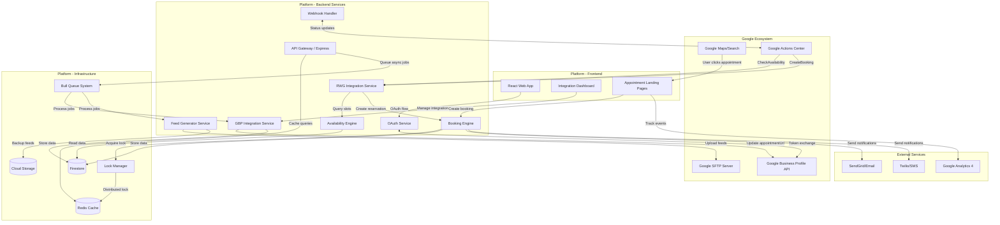

### Deployment Architecture

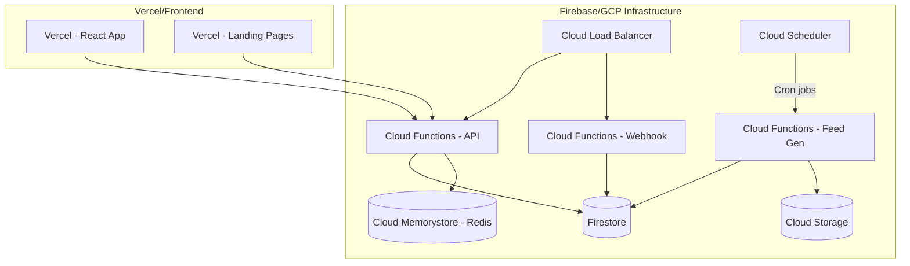

### Technology Stack

| Layer | Technology | Rationale |
|-------|-----------|-----------|
| **Frontend** | React 18 + TypeScript | Mevcut platform stack ile tutarlılık |
| **UI Components** | Material-UI / Tailwind CSS | Responsive, accessible component library |
| **API Gateway** | Express.js on Cloud Functions | Serverless, auto-scaling, cost-effective |
| **Database** | Firestore | Mevcut platform database, real-time capabilities |
| **Cache** | Cloud Memorystore (Redis) | Low-latency caching, distributed locking |
| **Queue** | Bull/BullMQ | Reliable job processing, retry mechanisms |
| **Storage** | Cloud Storage | Feed backups, large file storage |
| **Auth** | Firebase Auth + OAuth 2.0 | Secure authentication, Google integration |
| **Email** | SendGrid | Transactional email delivery |
| **SMS** | Twilio | SMS notifications |
| **Analytics** | Google Analytics 4 | Event tracking, funnel analysis |
| **Monitoring** | Cloud Monitoring + Sentry | Application monitoring, error tracking |

### Security Architecture

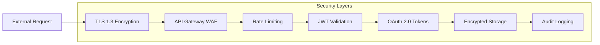

## Components and Interfaces

### Component Diagram

```mermaid
graph TB
    subgraph "OAuth Service Component"
        OA1[OAuth Controller]
        OA2[Token Manager]
        OA3[Token Encryption]
        OA4[Token Refresh Handler]
    end
    
    subgraph "GBP Integration Service"
        GB1[Location Manager]
        GB2[Attribute Updater]
        GB3[Sync Scheduler]
        GB4[API Client]
    end
    
    subgraph "RWG Integration Service"
        RW1[Real-Time API Handler]
        RW2[JWT Validator]
        RW3[Request Validator]
        RW4[Response Formatter]
    end
    
    subgraph "Booking Engine"
        BK1[Booking Controller]
        BK2[Validation Service]
        BK3[Lock Manager]
        BK4[Notification Service]
    end
    
    subgraph "Availability Engine"
        AV1[Slot Calculator]
        AV2[Calendar Manager]
        AV3[Cache Manager]
        AV4[Conflict Resolver]
    end
    
    subgraph "Feed Generator Service"
        FD1[Merchant Feed Builder]
        FD2[Service Feed Builder]
        FD3[Availability Feed Builder]
        FD4[SFTP Uploader]
    end
    
    OA1 --> OA2
    OA2 --> OA3
    OA2 --> OA4
    
    GB1 --> GB2
    GB2 --> GB4
    GB3 --> GB4
    
    RW1 --> RW2
    RW1 --> RW3
    RW1 --> RW4
    
    BK1 --> BK2
    BK1 --> BK3
    BK1 --> BK4
    
    AV1 --> AV2
    AV1 --> AV3
    AV2 --> AV4
    
    FD1 --> FD4
    FD2 --> FD4
    FD3 --> FD4

```

### 1. OAuth Service

**Responsibility**: Google hesabı bağlama, token yönetimi, yenileme

**Key APIs**:

```typescript
interface OAuthService {
  // OAuth akışı başlatma
  initiateOAuth(businessId: string): Promise<{
    authorizationUrl: string;
    state: string;
  }>;
  
  // Authorization code ile token değişimi
  handleCallback(code: string, state: string): Promise<{
    accessToken: string;
    refreshToken: string;
    expiresIn: number;
  }>;
  
  // Access token yenileme
  refreshAccessToken(businessId: string): Promise<string>;
  
  // Token iptal etme
  revokeTokens(businessId: string): Promise<void>;
  
  // Token geçerliliği kontrolü
  validateToken(businessId: string): Promise<boolean>;
}
```

**OAuth 2.0 Flow Sequence Diagram**:

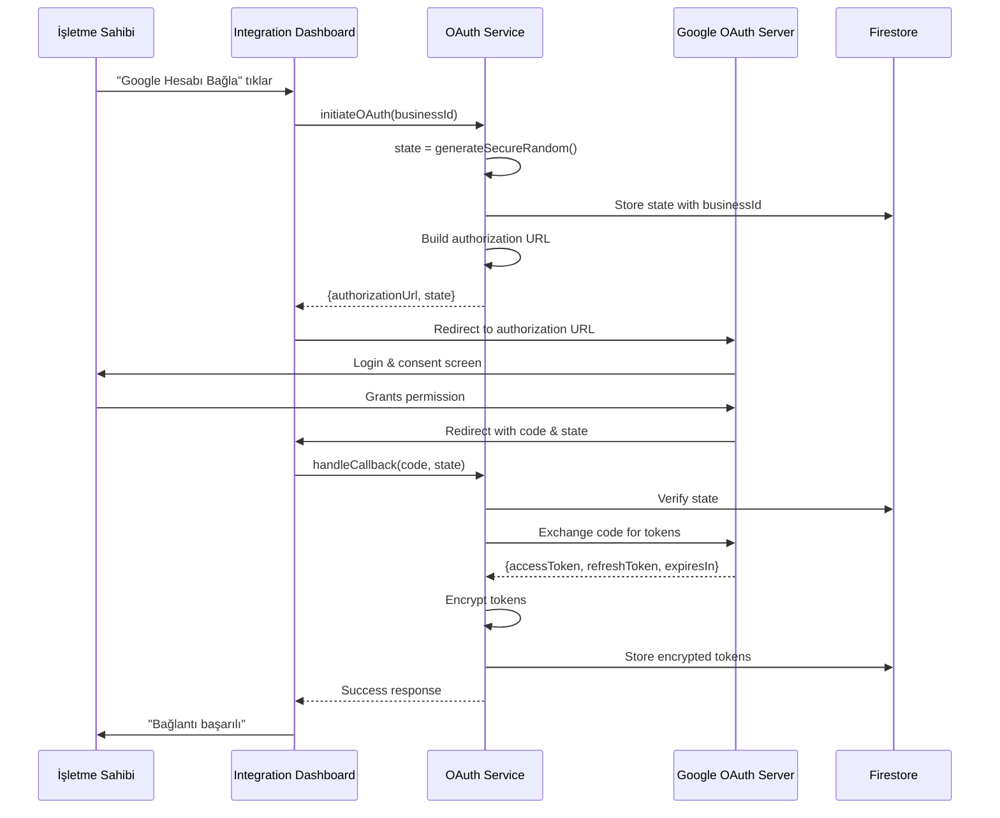

**Required Google API Scopes**:
- `https://www.googleapis.com/auth/business.manage` - GBP lokasyon bilgilerini okuma ve yazma

**Token Encryption Strategy**:
- Algorithm: AES-256-GCM
- Key: Cloud KMS managed encryption key
- IV: Randomly generated per token
- Store: `{encryptedData, iv, authTag}` in Firestore

### 2. GBP Integration Service

**Responsibility**: Google Business Profile lokasyon yönetimi, appointmentUrl güncelleme

**Key APIs**:

```typescript
interface GBPIntegrationService {
  // Lokasyonları listele
  listLocations(businessId: string): Promise<GBPLocation[]>;
  
  // Lokasyon detayı
  getLocation(businessId: string, locationId: string): Promise<GBPLocation>;
  
  // Appointment URL güncelleme
  updateAppointmentUrl(
    businessId: string, 
    locationId: string, 
    appointmentUrl: string
  ): Promise<void>;
  
  // Lokasyon senkronizasyonu
  syncLocations(businessId: string): Promise<SyncResult>;
  
  // Entegrasyon aktifleştirme
  activateIntegration(
    businessId: string, 
    locationId: string
  ): Promise<void>;
  
  // Entegrasyon deaktifleştirme
  deactivateIntegration(
    businessId: string, 
    locationId: string
  ): Promise<void>;
}

interface GBPLocation {
  locationId: string;
  name: string;
  address: {
    street: string;
    city: string;
    postalCode: string;
    country: string;
  };
  phone: string;
  category: string;
  verified: boolean;
  metadata: {
    lat: number;
    lng: number;
  };
}
```

**GBP API Integration Details**:

**Endpoint**: `PATCH https://mybusiness.googleapis.com/v4/{name=accounts/*/locations/*}`

**Request Schema**:
```json
{
  "name": "accounts/{accountId}/locations/{locationId}",
  "attributes": [
    {
      "attributeId": "url_appointment",
      "valueType": "URL",
      "values": ["https://yourplatform.com/book/business-slug/location-slug-uuid"]
    }
  ]
}
```

**Response Schema**:
```json
{
  "name": "accounts/{accountId}/locations/{locationId}",
  "locationName": "İşletme Adı",
  "primaryPhone": "+90...",
  "attributes": [
    {
      "attributeId": "url_appointment",
      "valueType": "URL",
      "values": ["https://yourplatform.com/book/business-slug/location-slug-uuid"]
    }
  ]
}
```

**Error Handling**:
- `401 Unauthorized`: Token refresh ve retry
- `403 Forbidden`: Yetki hatası, kullanıcı bilgilendirme
- `404 Not Found`: Lokasyon bulunamadı
- `429 Too Many Requests`: Exponential backoff (1s, 2s, 4s)
- `500 Internal Server Error`: Retry 3 kez, sonra queue'ya al

**Appointment URL Generation**:

```typescript
function generateAppointmentUrl(
  business: Business, 
  location: GBPLocation
): string {
  const businessSlug = slugify(business.name);
  const locationSlug = slugify(location.name);
  const uniqueId = generateShortUUID(); // 8 karakter
  
  return `https://yourplatform.com/book/${businessSlug}/${locationSlug}-${uniqueId}`;
}

// Örnek: https://yourplatform.com/book/mehmet-berber/kadikoy-subesi-a8f3d1e2
```


### 3. RWG Integration Service (Reserve with Google)

**Responsibility**: Real-time API endpoint'lerini sağlama, JWT doğrulama

**Key APIs**:

```typescript
interface RWGIntegrationService {
  // Müsaitlik kontrolü (Google'dan gelen istek)
  checkAvailability(request: CheckAvailabilityRequest): Promise<CheckAvailabilityResponse>;
  
  // Rezervasyon oluşturma (Google'dan gelen istek)
  createBooking(request: CreateBookingRequest): Promise<CreateBookingResponse>;
  
  // Rezervasyon durumu güncelleme (Platform'dan Google'a webhook)
  updateBookingStatus(bookingId: string, status: BookingStatus): Promise<void>;
  
  // JWT token doğrulama
  validateJWT(token: string): Promise<JWTPayload>;
}
```

**CheckAvailability API**:

**Endpoint**: `POST /v1/google/checkAvailability`

**Request Schema**:
```json
{
  "merchant_id": "business-uuid",
  "service_id": "service-uuid",
  "party_size": 1,
  "start_time": "2026-05-24T14:00:00+03:00",
  "end_time": "2026-05-24T18:00:00+03:00",
  "user_information": {
    "user_id": "google-user-id",
    "given_name": "Ahmet",
    "family_name": "Yılmaz",
    "email": "ahmet@example.com"
  }
}
```

**Response Schema**:
```json
{
  "available_slots": [
    {
      "start_time": "2026-05-24T14:00:00+03:00",
      "duration": "PT30M",
      "resources": {
        "staff_id": "staff-uuid-1",
        "staff_name": "Mehmet Usta"
      }
    },
    {
      "start_time": "2026-05-24T14:30:00+03:00",
      "duration": "PT30M",
      "resources": {
        "staff_id": "staff-uuid-1",
        "staff_name": "Mehmet Usta"
      }
    },
    {
      "start_time": "2026-05-24T15:00:00+03:00",
      "duration": "PT30M",
      "resources": {
        "staff_id": "staff-uuid-2",
        "staff_name": "Ali Usta"
      }
    }
  ]
}
```

**Implementation Flow**:

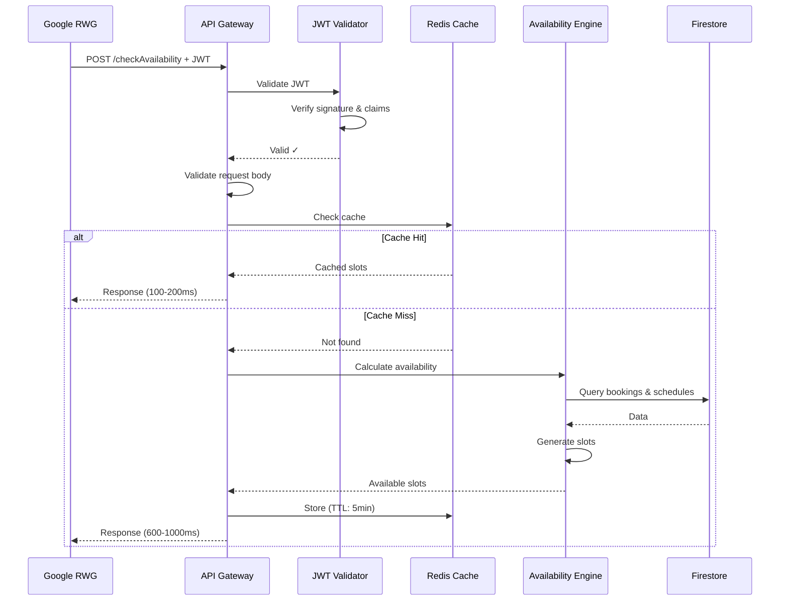

**CreateBooking API**:

**Endpoint**: `POST /v1/google/createBooking`

**Request Schema**:
```json
{
  "idempotency_key": "uuid-generated-by-google",
  "merchant_id": "business-uuid",
  "service_id": "service-uuid",
  "slot": {
    "start_time": "2026-05-24T14:00:00+03:00",
    "duration": "PT30M",
    "resources": {
      "staff_id": "staff-uuid-1"
    }
  },
  "user_information": {
    "user_id": "google-user-id",
    "given_name": "Ahmet",
    "family_name": "Yılmaz",
    "email": "ahmet@example.com",
    "phone": "+905551234567"
  },
  "payment_information": {
    "prepayment_status": "NOT_REQUIRED"
  }
}
```

**Response Schema**:
```json
{
  "booking": {
    "booking_id": "platform-booking-uuid",
    "status": "CONFIRMED",
    "merchant_id": "business-uuid",
    "service_id": "service-uuid",
    "start_time": "2026-05-24T14:00:00+03:00",
    "duration": "PT30M",
    "user_information": {
      "given_name": "Ahmet",
      "family_name": "Yılmaz",
      "email": "ahmet@example.com",
      "phone": "+905551234567"
    }
  },
  "confirmation_code": "ABC-123456",
  "booking_url": "https://yourplatform.com/booking/platform-booking-uuid"
}
```

**Error Response Schema**:
```json
{
  "error": {
    "code": "SLOT_UNAVAILABLE",
    "message": "Seçilen saat artık müsait değil",
    "alternative_slots": [
      {
        "start_time": "2026-05-24T14:30:00+03:00",
        "duration": "PT30M"
      }
    ]
  }
}
```

**CreateBooking Flow with Race Condition Prevention**:

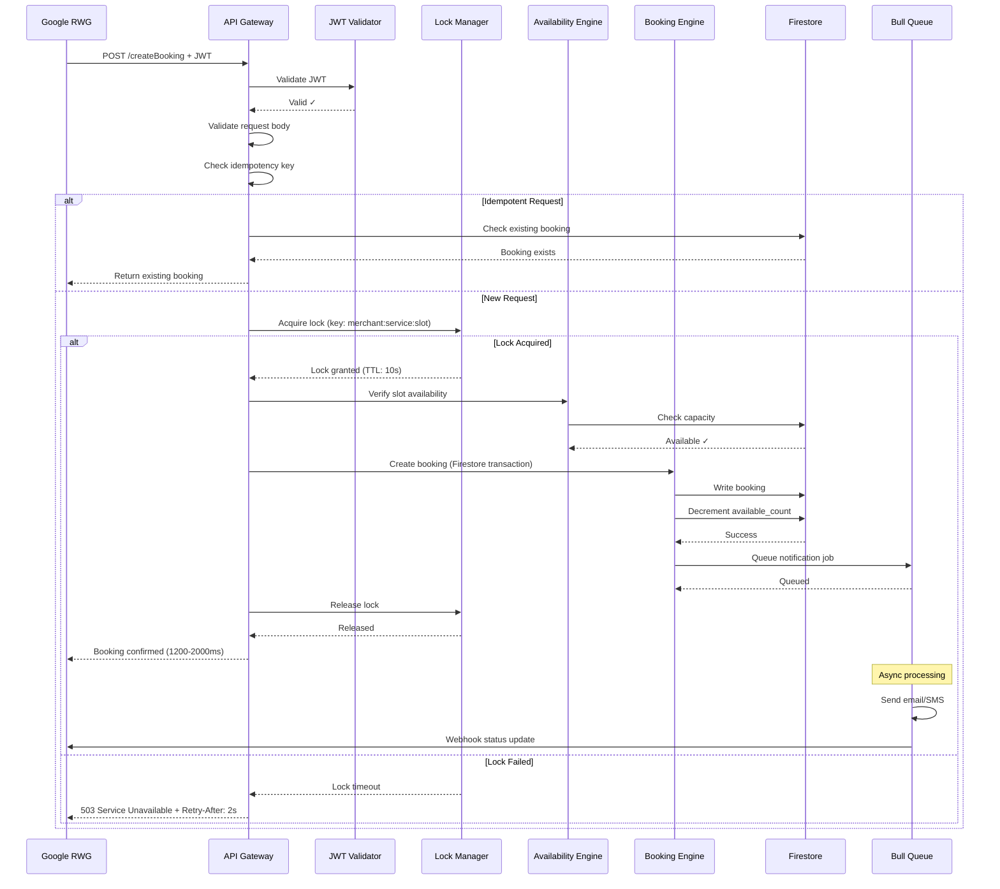


**JWT Validation Implementation**:

```typescript
interface JWTValidator {
  // Google public key'leri çekme
  fetchPublicKeys(): Promise<JWKSet>;
  
  // JWT token doğrulama
  verify(token: string): Promise<JWTPayload>;
}

interface JWTPayload {
  iss: string; // "https://accounts.google.com"
  aud: string; // Platform client ID
  sub: string; // Google user ID
  exp: number; // Expiration timestamp
  iat: number; // Issued at timestamp
  jti: string; // JWT ID (replay attack prevention)
}

// Implementation
class GoogleJWTValidator implements JWTValidator {
  private publicKeysCache: Map<string, JsonWebKey>;
  private publicKeysCacheExpiry: number;
  
  async fetchPublicKeys(): Promise<JWKSet> {
    const response = await fetch('https://www.googleapis.com/oauth2/v3/certs');
    const jwks = await response.json();
    
    // Cache for 24 hours
    this.publicKeysCache = new Map(
      jwks.keys.map(key => [key.kid, key])
    );
    this.publicKeysCacheExpiry = Date.now() + 86400000;
    
    return jwks;
  }
  
  async verify(token: string): Promise<JWTPayload> {
    // Decode header to get kid
    const header = this.decodeHeader(token);
    
    // Get public key
    if (!this.publicKeysCache.has(header.kid) || 
        Date.now() > this.publicKeysCacheExpiry) {
      await this.fetchPublicKeys();
    }
    
    const publicKey = this.publicKeysCache.get(header.kid);
    
    // Verify signature
    const payload = await this.verifySignature(token, publicKey);
    
    // Verify claims
    if (payload.iss !== 'https://accounts.google.com') {
      throw new Error('Invalid issuer');
    }
    
    if (payload.aud !== process.env.GOOGLE_CLIENT_ID) {
      throw new Error('Invalid audience');
    }
    
    if (payload.exp < Date.now() / 1000) {
      throw new Error('Token expired');
    }
    
    // Check replay attack (jti)
    const jtiKey = `jwt:jti:${payload.jti}`;
    const exists = await redis.exists(jtiKey);
    if (exists) {
      throw new Error('Token already used (replay attack)');
    }
    
    // Store jti for 1 hour
    await redis.setex(jtiKey, 3600, '1');
    
    return payload;
  }
}
```

### 4. Feed Generator Service

**Responsibility**: Google'a iletmek üzere Merchant, Service ve Availability feed'lerini oluşturma

**Key APIs**:

```typescript
interface FeedGeneratorService {
  // Merchant feed oluştur
  generateMerchantFeed(): Promise<FeedResult>;
  
  // Service feed oluştur
  generateServiceFeed(): Promise<FeedResult>;
  
  // Availability feed oluştur
  generateAvailabilityFeed(): Promise<FeedResult>;
  
  // Incremental feed oluştur
  generateIncrementalFeed(
    feedType: FeedType, 
    since: Date
  ): Promise<FeedResult>;
  
  // SFTP upload
  uploadToGoogleSFTP(
    fileName: string, 
    content: Buffer
  ): Promise<void>;
}

interface FeedResult {
  fileName: string;
  recordCount: number;
  fileSize: number;
  duration: number;
  status: 'success' | 'failure';
  errors?: string[];
}
```

**Merchant Feed Schema** (JSON Lines format):

```json
{"merchant_id":"business-uuid-1","name":"Mehmet Kuaför","address":{"street":"Kadıköy Caddesi No:123","city":"İstanbul","postal_code":"34710","country":"TR"},"phone":"+902161234567","url":"https://yourplatform.com/business/mehmet-kuafor","category":"hair_salon","location":{"latitude":40.9905,"longitude":29.0275}}
{"merchant_id":"business-uuid-2","name":"Güzellik Salonu","address":{"street":"Bağdat Caddesi No:456","city":"İstanbul","postal_code":"34728","country":"TR"},"phone":"+902162345678","url":"https://yourplatform.com/business/guzellik-salonu","category":"beauty_salon","location":{"latitude":40.9656,"longitude":29.1044}}
```

**Service Feed Schema**:

```json
{"service_id":"service-uuid-1","merchant_id":"business-uuid-1","service_name":"Saç Kesimi","description":"Erkek saç kesimi ve şekillendirme","duration":"PT30M","price":{"amount":"150.00","currency_code":"TRY"},"category":"haircut"}
{"service_id":"service-uuid-2","merchant_id":"business-uuid-1","service_name":"Sakal Tıraşı","description":"Ustura ile profesyonel sakal tıraşı","duration":"PT20M","price":{"amount":"100.00","currency_code":"TRY"},"category":"shave"}
```

**Availability Feed Schema**:

```json
{"slot_id":"slot-uuid-1","merchant_id":"business-uuid-1","service_id":"service-uuid-1","start_time":"2026-05-24T09:00:00+03:00","duration":"PT30M","available_spots":1,"resources":{"staff_id":"staff-uuid-1","staff_name":"Mehmet Usta"}}
{"slot_id":"slot-uuid-2","merchant_id":"business-uuid-1","service_id":"service-uuid-1","start_time":"2026-05-24T09:30:00+03:00","duration":"PT30M","available_spots":1,"resources":{"staff_id":"staff-uuid-1","staff_name":"Mehmet Usta"}}
```

**Feed Generation Flow**:

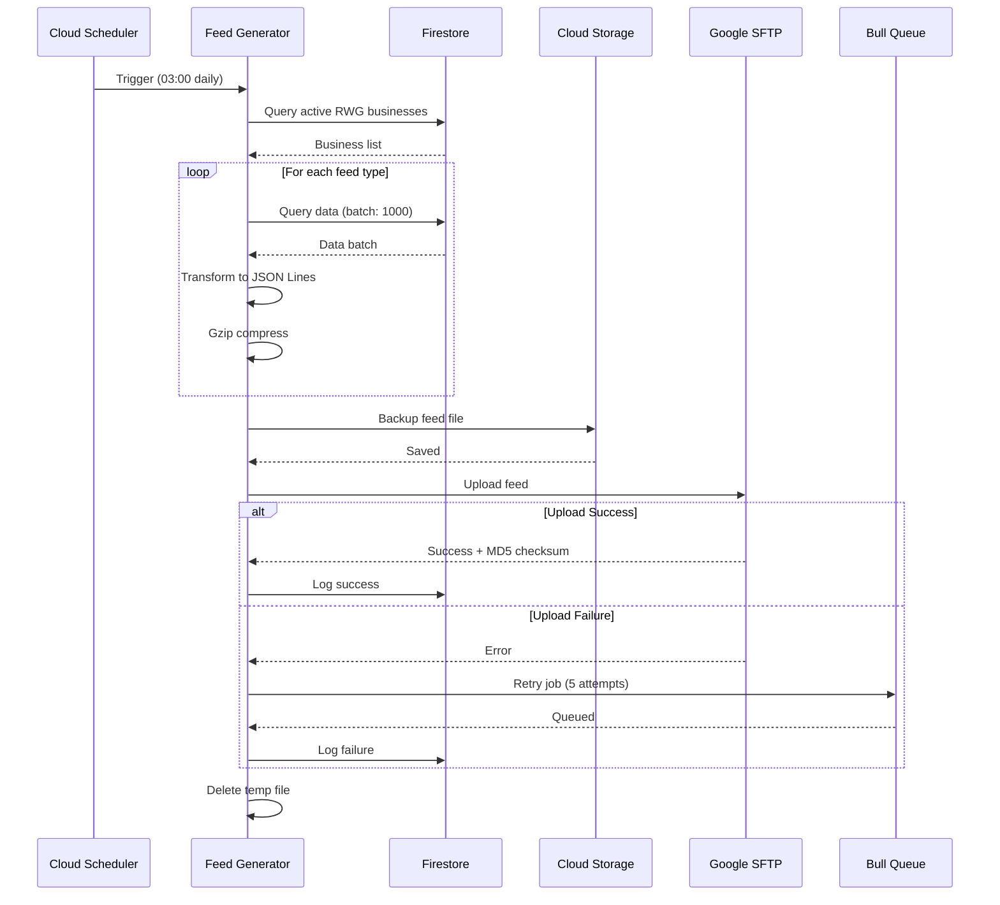

**SFTP Connection Details**:

```typescript
interface SFTPConfig {
  host: string; // Provided by Google
  port: number; // 22
  username: string; // Provided by Google
  privateKey: string; // Generated by platform, public key shared with Google
}

class GoogleSFTPClient {
  async upload(localPath: string, remotePath: string): Promise<void> {
    const sftp = new SFTPClient();
    
    try {
      await sftp.connect({
        host: this.config.host,
        port: this.config.port,
        username: this.config.username,
        privateKey: this.config.privateKey
      });
      
      // Upload file
      await sftp.fastPut(localPath, remotePath);
      
      // Verify with MD5
      const localMD5 = await this.calculateMD5(localPath);
      const remoteMD5 = await sftp.get(`${remotePath}.md5`);
      
      if (localMD5 !== remoteMD5) {
        throw new Error('MD5 checksum mismatch');
      }
      
    } finally {
      await sftp.end();
    }
  }
}
```


### 5. Booking Engine

**Responsibility**: Rezervasyon oluşturma, güncelleme, iptal işlemleri

**Key APIs**:

```typescript
interface BookingEngine {
  // Rezervasyon oluştur
  createBooking(request: CreateBookingRequest): Promise<Booking>;
  
  // Rezervasyon güncelle
  updateBooking(bookingId: string, updates: Partial<Booking>): Promise<Booking>;
  
  // Rezervasyon iptal et
  cancelBooking(bookingId: string, reason: string): Promise<void>;
  
  // Rezervasyon detayı
  getBooking(bookingId: string): Promise<Booking>;
  
  // İdempotency kontrolü
  checkIdempotency(idempotencyKey: string): Promise<Booking | null>;
}

interface Booking {
  bookingId: string;
  businessId: string;
  locationId: string;
  serviceId: string;
  staffId: string;
  customerId: string;
  startTime: Date;
  endTime: Date;
  duration: number; // minutes
  status: BookingStatus;
  source: BookingSource;
  googleBookingId?: string;
  idempotencyKey?: string;
  metadata: {
    customerName: string;
    customerEmail: string;
    customerPhone: string;
    notes?: string;
  };
  createdAt: Date;
  updatedAt: Date;
}

enum BookingStatus {
  PENDING = 'pending',
  CONFIRMED = 'confirmed',
  CANCELLED_BY_MERCHANT = 'cancelled_by_merchant',
  CANCELLED_BY_USER = 'cancelled_by_user',
  COMPLETED = 'completed',
  NO_SHOW = 'no_show'
}

enum BookingSource {
  DIRECT = 'direct',
  GOOGLE_RESERVE = 'google_reserve',
  GOOGLE_APPOINTMENT_URL = 'google_appointment_url'
}
```

### 6. Availability Engine

**Responsibility**: Müsaitlik hesaplama, slot oluşturma, çakışma kontrolü

**Key APIs**:

```typescript
interface AvailabilityEngine {
  // Müsait slotları hesapla
  calculateAvailableSlots(request: AvailabilityRequest): Promise<TimeSlot[]>;
  
  // Slot müsaitliği doğrula
  verifySlotAvailability(
    businessId: string,
    serviceId: string,
    startTime: Date
  ): Promise<boolean>;
  
  // Kapasiteyi kontrol et
  checkCapacity(
    businessId: string,
    serviceId: string,
    startTime: Date
  ): Promise<number>;
}

interface AvailabilityRequest {
  businessId: string;
  serviceId: string;
  startDate: Date;
  endDate: Date;
  timezone: string;
}

interface TimeSlot {
  startTime: Date;
  duration: number; // minutes
  availableSpots: number;
  resources: {
    staffId: string;
    staffName: string;
  };
}
```

**Availability Calculation Algorithm**:

```typescript
async calculateAvailableSlots(request: AvailabilityRequest): Promise<TimeSlot[]> {
  // 1. Business çalışma saatlerini al
  const workingHours = await this.getWorkingHours(
    request.businessId, 
    request.startDate, 
    request.endDate
  );
  
  // 2. Service bilgilerini al (süre, personel gereksinimleri)
  const service = await this.getService(request.serviceId);
  
  // 3. Personel müsaitliğini al
  const staffAvailability = await this.getStaffAvailability(
    request.businessId,
    request.startDate,
    request.endDate
  );
  
  // 4. Mevcut rezervasyonları al
  const existingBookings = await this.getExistingBookings(
    request.businessId,
    request.startDate,
    request.endDate
  );
  
  // 5. Tatil günlerini al
  const holidays = await this.getHolidays(
    request.businessId,
    request.startDate,
    request.endDate
  );
  
  // 6. Slotları oluştur
  const slots: TimeSlot[] = [];
  
  for (const day of eachDayOfInterval({start: request.startDate, end: request.endDate})) {
    // Tatil günü mü kontrolü
    if (holidays.includes(format(day, 'yyyy-MM-dd'))) continue;
    
    const dayWorkingHours = workingHours[format(day, 'EEEE')];
    if (!dayWorkingHours) continue;
    
    // Çalışma saatleri içinde slot'lar oluştur
    for (const timeRange of dayWorkingHours) {
      let currentTime = parseISO(`${format(day, 'yyyy-MM-dd')}T${timeRange.start}`);
      const endTime = parseISO(`${format(day, 'yyyy-MM-dd')}T${timeRange.end}`);
      
      while (addMinutes(currentTime, service.duration) <= endTime) {
        // Personel müsait mi?
        const availableStaff = staffAvailability.filter(staff => 
          this.isStaffAvailable(staff, currentTime, service.duration) &&
          !this.hasConflictingBooking(staff.id, currentTime, service.duration, existingBookings)
        );
        
        if (availableStaff.length > 0) {
          slots.push({
            startTime: currentTime,
            duration: service.duration,
            availableSpots: availableStaff.length,
            resources: {
              staffId: availableStaff[0].id,
              staffName: availableStaff[0].name
            }
          });
        }
        
        // Slot interval'ı kadar ilerle (örn: 15 dakika)
        currentTime = addMinutes(currentTime, service.slotInterval || 15);
      }
    }
  }
  
  return slots;
}
```


## Data Models

### Firestore Collections and Schemas

#### 1. google_integrations

```typescript
interface GoogleIntegration {
  // Document ID: {businessId}
  businessId: string;
  
  // OAuth tokens (encrypted)
  oauthTokens: {
    accessToken: string; // AES-256-GCM encrypted
    refreshToken: string; // AES-256-GCM encrypted
    expiresAt: FirebaseFirestore.Timestamp;
    scope: string[];
  };
  
  // GBP locations
  locations: Array<{
    gbpLocationId: string; // "accounts/{accountId}/locations/{locationId}"
    name: string;
    address: {
      street: string;
      city: string;
      state?: string;
      postalCode: string;
      country: string;
    };
    phone: string;
    category: string;
    verified: boolean;
    isActive: boolean; // Integration active?
    appointmentUrl?: string;
    lastSyncedAt: FirebaseFirestore.Timestamp;
  }>;
  
  // RWG status
  rwgStatus: 'inactive' | 'pending' | 'active';
  rwgActivatedAt?: FirebaseFirestore.Timestamp;
  
  // Package/subscription
  packageType: 'visibility' | 'reservation' | null;
  packageExpiry?: FirebaseFirestore.Timestamp;
  
  // Notification preferences
  notificationPreferences: {
    email: boolean;
    sms: boolean;
    inApp: boolean;
    events: {
      newBooking: boolean;
      bookingCancelled: boolean;
      syncError: boolean;
      tokenExpiry: boolean;
    };
  };
  
  // Metadata
  createdAt: FirebaseFirestore.Timestamp;
  updatedAt: FirebaseFirestore.Timestamp;
}

// Firestore indexes
// Composite: businessId + locations.isActive
// Composite: rwgStatus + packageExpiry
```

#### 2. google_bookings

```typescript
interface GoogleBooking {
  // Document ID: {bookingId} (UUID)
  bookingId: string;
  
  // Google reference
  googleBookingId?: string;
  idempotencyKey?: string;
  
  // Business references
  businessId: string;
  locationId: string;
  serviceId: string;
  staffId: string;
  
  // Customer information
  customer: {
    id?: string; // If registered user
    googleUserId?: string;
    name: string;
    email: string;
    phone: string;
  };
  
  // Booking details
  startTime: FirebaseFirestore.Timestamp;
  endTime: FirebaseFirestore.Timestamp;
  duration: number; // minutes
  timezone: string; // IANA timezone
  
  // Status
  status: BookingStatus;
  statusHistory: Array<{
    status: BookingStatus;
    changedAt: FirebaseFirestore.Timestamp;
    changedBy: string; // user ID or 'system'
    reason?: string;
  }>;
  
  // Source tracking
  source: BookingSource;
  sourceMetadata?: {
    utmSource?: string;
    utmMedium?: string;
    utmCampaign?: string;
    referrer?: string;
  };
  
  // Payment
  payment?: {
    amount: number;
    currency: string;
    status: 'not_required' | 'pending' | 'completed' | 'refunded';
    transactionId?: string;
  };
  
  // Notes
  notes?: string;
  internalNotes?: string;
  
  // Metadata
  createdAt: FirebaseFirestore.Timestamp;
  updatedAt: FirebaseFirestore.Timestamp;
  confirmedAt?: FirebaseFirestore.Timestamp;
  completedAt?: FirebaseFirestore.Timestamp;
  cancelledAt?: FirebaseFirestore.Timestamp;
}

// Firestore indexes
// Composite: businessId + startTime + status
// Composite: businessId + source + createdAt
// Composite: staffId + startTime + status
// Single: idempotencyKey
// Single: googleBookingId
```

#### 3. google_audit_logs

```typescript
interface GoogleAuditLog {
  // Document ID: auto-generated
  logId: string;
  
  // Context
  businessId?: string;
  locationId?: string;
  bookingId?: string;
  
  // Event details
  eventType: 
    | 'oauth.connected'
    | 'oauth.refreshed'
    | 'oauth.revoked'
    | 'gbp.location_synced'
    | 'gbp.appointment_url_updated'
    | 'rwg.check_availability'
    | 'rwg.create_booking'
    | 'feed.generated'
    | 'feed.uploaded'
    | 'webhook.sent'
    | 'notification.sent';
  
  eventData: Record<string, any>;
  
  // Result
  status: 'success' | 'failure' | 'partial';
  errorCode?: string;
  errorMessage?: string;
  
  // Performance
  duration?: number; // milliseconds
  
  // Tracing
  correlationId: string; // For distributed tracing
  requestId?: string;
  
  // Source
  source: 'api' | 'cron' | 'manual' | 'webhook';
  userId?: string;
  ipAddress?: string;
  
  // Timestamp
  timestamp: FirebaseFirestore.Timestamp;
}

// Firestore indexes
// Composite: businessId + timestamp (desc)
// Composite: eventType + status + timestamp (desc)
// Single: correlationId
// TTL: 90 days (Firestore TTL policy)
```

#### 4. google_feed_status

```typescript
interface GoogleFeedStatus {
  // Document ID: {feedType}_{timestamp}
  feedId: string;
  
  // Feed details
  feedType: 'merchant' | 'service' | 'availability';
  isIncremental: boolean;
  
  // Generation
  generatedAt: FirebaseFirestore.Timestamp;
  recordCount: number;
  fileSize: number; // bytes
  fileName: string;
  duration: number; // milliseconds
  
  // Upload
  uploadStatus: 'pending' | 'uploading' | 'success' | 'failed';
  uploadedAt?: FirebaseFirestore.Timestamp;
  uploadAttempts: number;
  uploadError?: string;
  
  // Google processing
  googleProcessedAt?: FirebaseFirestore.Timestamp;
  googleStatus?: 'processing' | 'success' | 'failed';
  googleErrors?: Array<{
    recordId: string;
    errorCode: string;
    errorMessage: string;
  }>;
  
  // Metadata
  createdAt: FirebaseFirestore.Timestamp;
}

// Firestore indexes
// Composite: feedType + generatedAt (desc)
// Composite: uploadStatus + uploadAttempts
```

#### 5. google_cache_invalidation

```typescript
interface CacheInvalidation {
  // Document ID: auto-generated
  invalidationId: string;
  
  // Cache key pattern
  pattern: string; // e.g., "avail:business-uuid-1:*"
  
  // Reason
  reason: 'booking_created' | 'booking_cancelled' | 'schedule_updated' | 'service_updated';
  triggeredBy: string; // userId or 'system'
  
  // Status
  status: 'pending' | 'completed' | 'failed';
  processedAt?: FirebaseFirestore.Timestamp;
  
  // Timestamp
  createdAt: FirebaseFirestore.Timestamp;
}
```

### Redis Data Structures

#### 1. Cache Keys

```typescript
// Availability cache
// Key: avail:{businessId}:{serviceId}:{date}
// Value: JSON string of TimeSlot[]
// TTL: 300 seconds (5 minutes)

// Business data cache
// Key: business:{businessId}
// Value: JSON string of Business
// TTL: 3600 seconds (1 hour)

// Service catalog cache
// Key: services:{businessId}
// Value: JSON string of Service[]
// TTL: 7200 seconds (2 hours)

// JWT JTI tracking (replay attack prevention)
// Key: jwt:jti:{jti}
// Value: "1"
// TTL: 3600 seconds (1 hour)
```

#### 2. Distributed Locks

```typescript
// Lock key format: lock:{businessId}:{serviceId}:{slotTime}
// Value: {lockId}:{timestamp}
// TTL: 10 seconds

interface LockManager {
  async acquireLock(key: string, lockId: string, ttl: number): Promise<boolean> {
    // SET key value NX EX ttl
    const result = await redis.set(key, `${lockId}:${Date.now()}`, 'NX', 'EX', ttl);
    return result === 'OK';
  }
  
  async releaseLock(key: string, lockId: string): Promise<void> {
    // Lua script for atomic check-and-delete
    const script = `
      if redis.call("get", KEYS[1]) == ARGV[1] then
        return redis.call("del", KEYS[1])
      else
        return 0
      end
    `;
    await redis.eval(script, 1, key, lockId);
  }
}
```

#### 3. Rate Limiting

```typescript
// Rate limit key: ratelimit:{endpoint}:{identifier}
// Value: counter
// TTL: window size (seconds)

interface RateLimiter {
  async checkLimit(
    endpoint: string, 
    identifier: string, 
    limit: number, 
    window: number
  ): Promise<boolean> {
    const key = `ratelimit:${endpoint}:${identifier}`;
    const current = await redis.incr(key);
    
    if (current === 1) {
      await redis.expire(key, window);
    }
    
    return current <= limit;
  }
}

// Examples:
// CheckAvailability: 10 req/sec per merchant
// CreateBooking: 5 req/sec per merchant
// OAuth callback: 20 req/min per IP
```

### Entity Relationship Diagram

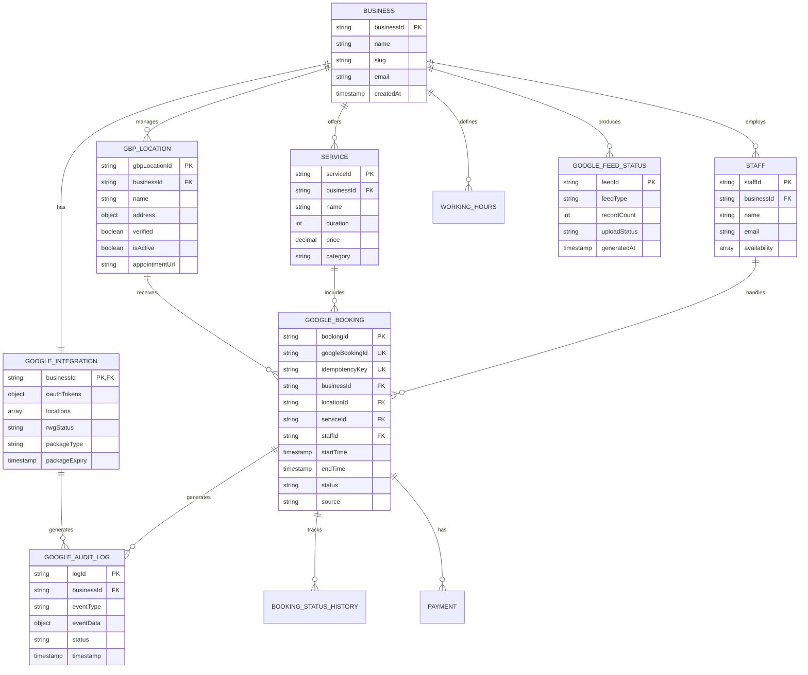


## Error Handling

### Error Classification and Response Strategy

#### 1. Client Errors (4xx)

| Error Code | Scenario | Response Strategy |
|------------|----------|-------------------|
| 400 Bad Request | Invalid request format | Return detailed validation errors |
| 401 Unauthorized | JWT validation failed | Return generic auth error (no details) |
| 403 Forbidden | Insufficient permissions | Return generic permission error |
| 404 Not Found | Resource not found | Return resource type and ID |
| 409 Conflict | Slot already booked | Return alternative slots |
| 429 Too Many Requests | Rate limit exceeded | Return Retry-After header |

**Example Error Response**:
```json
{
  "error": {
    "code": "VALIDATION_ERROR",
    "message": "Request validation failed",
    "details": [
      {
        "field": "start_time",
        "issue": "must be in ISO 8601 format",
        "value": "2026-05-24 14:00:00"
      }
    ]
  }
}
```

#### 2. Server Errors (5xx)

| Error Code | Scenario | Response Strategy |
|------------|----------|-------------------|
| 500 Internal Server Error | Unexpected server error | Log full stack, return generic message |
| 502 Bad Gateway | External service (GBP/Google) failed | Retry with exponential backoff |
| 503 Service Unavailable | Service overloaded or maintenance | Return Retry-After header |
| 504 Gateway Timeout | External service timeout | Log and notify, queue for retry |

**Example Error Response**:
```json
{
  "error": {
    "code": "INTERNAL_ERROR",
    "message": "An unexpected error occurred. Please try again later.",
    "request_id": "req_abc123",
    "support_email": "support@yourplatform.com"
  }
}
```

### Circuit Breaker Implementation

```typescript
interface CircuitBreaker {
  state: 'CLOSED' | 'OPEN' | 'HALF_OPEN';
  failureCount: number;
  failureThreshold: number;
  timeout: number;
  lastFailureTime?: number;
}

class ExternalServiceCircuitBreaker {
  private breakers: Map<string, CircuitBreaker> = new Map();
  
  async call<T>(
    serviceName: string, 
    fn: () => Promise<T>
  ): Promise<T> {
    const breaker = this.getBreaker(serviceName);
    
    // Circuit OPEN - reject immediately
    if (breaker.state === 'OPEN') {
      if (Date.now() - breaker.lastFailureTime! > breaker.timeout) {
        breaker.state = 'HALF_OPEN';
      } else {
        throw new Error(`Circuit breaker is OPEN for ${serviceName}`);
      }
    }
    
    try {
      const result = await fn();
      
      // Success - reset or close circuit
      if (breaker.state === 'HALF_OPEN') {
        breaker.state = 'CLOSED';
        breaker.failureCount = 0;
      }
      
      return result;
      
    } catch (error) {
      breaker.failureCount++;
      breaker.lastFailureTime = Date.now();
      
      // Open circuit if threshold reached
      if (breaker.failureCount >= breaker.failureThreshold) {
        breaker.state = 'OPEN';
        await this.notifyCircuitOpen(serviceName);
      }
      
      throw error;
    }
  }
  
  private getBreaker(serviceName: string): CircuitBreaker {
    if (!this.breakers.has(serviceName)) {
      this.breakers.set(serviceName, {
        state: 'CLOSED',
        failureCount: 0,
        failureThreshold: 10,
        timeout: 300000 // 5 minutes
      });
    }
    return this.breakers.get(serviceName)!;
  }
}

// Usage
const circuitBreaker = new ExternalServiceCircuitBreaker();

// GBP API call with circuit breaker
const locations = await circuitBreaker.call('gbp-api', async () => {
  return await gbpClient.listLocations(businessId);
});
```

### Retry Strategy with Exponential Backoff

```typescript
interface RetryConfig {
  maxAttempts: number;
  initialDelay: number; // milliseconds
  maxDelay: number; // milliseconds
  factor: number; // exponential multiplier
  retryableErrors: string[];
}

async function retryWithBackoff<T>(
  fn: () => Promise<T>,
  config: RetryConfig
): Promise<T> {
  let attempt = 0;
  let delay = config.initialDelay;
  
  while (attempt < config.maxAttempts) {
    try {
      return await fn();
      
    } catch (error) {
      attempt++;
      
      // Check if error is retryable
      const isRetryable = config.retryableErrors.some(code => 
        error.code === code || error.status === code
      );
      
      if (!isRetryable || attempt >= config.maxAttempts) {
        throw error;
      }
      
      // Log retry attempt
      logger.warn('Retrying operation', {
        attempt,
        nextDelay: delay,
        error: error.message
      });
      
      // Wait before retry
      await sleep(delay);
      
      // Calculate next delay (exponential backoff with jitter)
      delay = Math.min(
        delay * config.factor + Math.random() * 1000,
        config.maxDelay
      );
    }
  }
  
  throw new Error('Max retry attempts exceeded');
}

// Usage examples
// GBP API update with retry
await retryWithBackoff(
  () => gbpClient.updateAppointmentUrl(locationId, url),
  {
    maxAttempts: 3,
    initialDelay: 1000,
    maxDelay: 10000,
    factor: 2,
    retryableErrors: ['429', '500', '502', '503', '504']
  }
);

// SFTP upload with retry
await retryWithBackoff(
  () => sftpClient.upload(localPath, remotePath),
  {
    maxAttempts: 5,
    initialDelay: 60000, // 1 minute
    maxDelay: 960000, // 16 minutes
    factor: 2,
    retryableErrors: ['ECONNREFUSED', 'ETIMEDOUT', 'ENOTFOUND']
  }
);
```

### Fallback Mechanisms

```typescript
class AvailabilityServiceWithFallback {
  async getAvailableSlots(
    businessId: string,
    serviceId: string,
    date: string
  ): Promise<TimeSlot[]> {
    try {
      // Primary: Real-time calculation
      return await this.calculateRealTimeAvailability(
        businessId, 
        serviceId, 
        date
      );
      
    } catch (error) {
      logger.error('Real-time availability calculation failed', error);
      
      try {
        // Fallback 1: Cached availability
        const cached = await this.getCachedAvailability(
          businessId, 
          serviceId, 
          date
        );
        
        if (cached) {
          logger.warn('Serving cached availability (stale data)');
          return cached;
        }
        
      } catch (cacheError) {
        logger.error('Cache fallback failed', cacheError);
      }
      
      // Fallback 2: Generate generic slots based on business hours
      logger.warn('Serving generic availability slots');
      return await this.generateGenericSlots(businessId, serviceId, date);
    }
  }
  
  private async generateGenericSlots(
    businessId: string,
    serviceId: string,
    date: string
  ): Promise<TimeSlot[]> {
    // Fetch business working hours
    const workingHours = await this.getWorkingHours(businessId);
    const service = await this.getService(serviceId);
    
    // Generate slots every 30 minutes during working hours
    const slots: TimeSlot[] = [];
    const dayOfWeek = format(parseISO(date), 'EEEE');
    const hours = workingHours[dayOfWeek];
    
    if (hours) {
      let current = parseISO(`${date}T${hours.start}`);
      const end = parseISO(`${date}T${hours.end}`);
      
      while (addMinutes(current, service.duration) <= end) {
        slots.push({
          startTime: current,
          duration: service.duration,
          availableSpots: 1,
          resources: { staffId: 'any', staffName: 'Available' }
        });
        
        current = addMinutes(current, 30);
      }
    }
    
    return slots;
  }
}
```

### Graceful Degradation Strategy

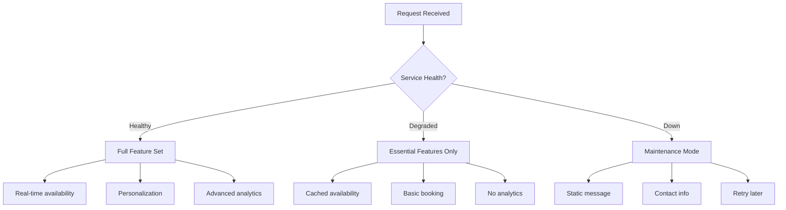

**Implementation**:

```typescript
class SystemHealthChecker {
  async getSystemHealth(): Promise<SystemHealth> {
    const checks = await Promise.allSettled([
      this.checkDatabase(),
      this.checkCache(),
      this.checkGoogleAPI(),
      this.checkQueue()
    ]);
    
    const dbHealthy = checks[0].status === 'fulfilled';
    const cacheHealthy = checks[1].status === 'fulfilled';
    const googleHealthy = checks[2].status === 'fulfilled';
    const queueHealthy = checks[3].status === 'fulfilled';
    
    // Determine overall health
    if (dbHealthy && cacheHealthy && googleHealthy && queueHealthy) {
      return { status: 'healthy', features: 'full' };
    }
    
    if (dbHealthy && (cacheHealthy || googleHealthy)) {
      return { status: 'degraded', features: 'essential' };
    }
    
    return { status: 'down', features: 'none' };
  }
}

// Middleware to enforce graceful degradation
app.use(async (req, res, next) => {
  const health = await healthChecker.getSystemHealth();
  
  if (health.status === 'down') {
    return res.status(503).json({
      error: {
        code: 'SERVICE_UNAVAILABLE',
        message: 'System is temporarily unavailable. Please try again later.',
        status_page: 'https://status.yourplatform.com'
      }
    });
  }
  
  if (health.status === 'degraded') {
    res.setHeader('X-Service-Status', 'degraded');
  }
  
  req.systemHealth = health;
  next();
});
```


## Testing Strategy

### Testing Pyramid

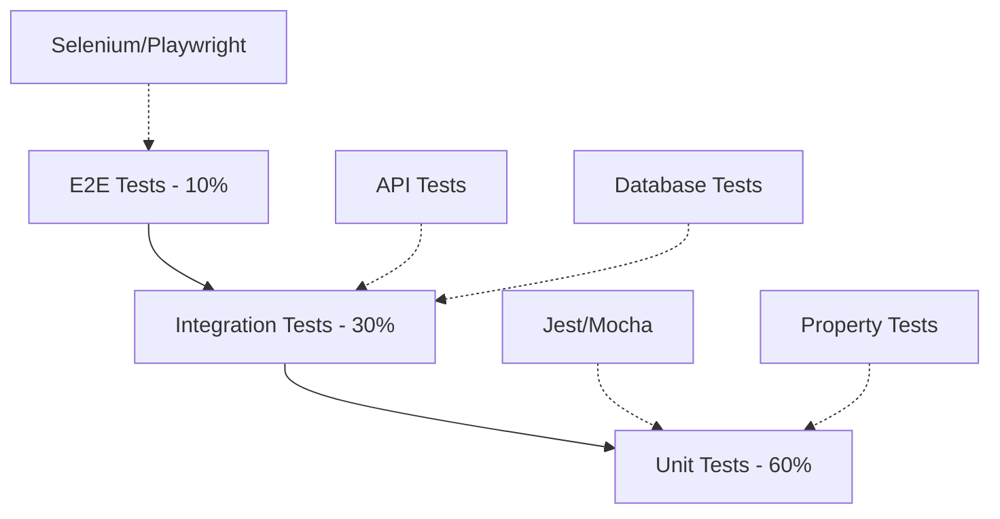

### 1. Unit Tests

**Coverage Goal**: 80% code coverage

**Test Framework**: Jest + TypeScript

**Focus Areas**:
- Business logic validation
- Data transformation functions
- Error handling edge cases
- Utility functions

**Example Unit Tests**:

```typescript
describe('AppointmentUrlGenerator', () => {
  it('should generate unique URL for each location', () => {
    const url1 = generateAppointmentUrl(business, location1);
    const url2 = generateAppointmentUrl(business, location2);
    
    expect(url1).not.toBe(url2);
    expect(url1).toMatch(/^https:\/\/yourplatform\.com\/book\/.+/);
  });
  
  it('should handle special characters in business name', () => {
    const business = { name: 'Mehmet\'s Café & Barber' };
    const url = generateAppointmentUrl(business, location);
    
    expect(url).toBe('https://yourplatform.com/book/mehmets-cafe-barber/...');
  });
});

describe('JWTValidator', () => {
  it('should reject expired token', async () => {
    const expiredToken = generateToken({ exp: Date.now() / 1000 - 3600 });
    
    await expect(jwtValidator.verify(expiredToken))
      .rejects
      .toThrow('Token expired');
  });
  
  it('should reject invalid issuer', async () => {
    const token = generateToken({ iss: 'https://evil.com' });
    
    await expect(jwtValidator.verify(token))
      .rejects
      .toThrow('Invalid issuer');
  });
  
  it('should detect replay attack', async () => {
    const token = generateToken({ jti: 'unique-id-123' });
    
    // First use - should succeed
    await jwtValidator.verify(token);
    
    // Second use - should fail
    await expect(jwtValidator.verify(token))
      .rejects
      .toThrow('Token already used');
  });
});

describe('AvailabilityCalculator', () => {
  it('should exclude booked slots', () => {
    const bookings = [
      { startTime: '2026-05-24T14:00:00', duration: 30 }
    ];
    
    const slots = calculateSlots(businessHours, bookings, service);
    
    const bookedSlot = slots.find(s => 
      s.startTime === '2026-05-24T14:00:00'
    );
    
    expect(bookedSlot).toBeUndefined();
  });
  
  it('should handle overlapping bookings', () => {
    const bookings = [
      { startTime: '2026-05-24T14:00:00', duration: 60 },
      { startTime: '2026-05-24T14:30:00', duration: 30 }
    ];
    
    const slots = calculateSlots(businessHours, bookings, service);
    
    expect(slots).not.toContainEqual(
      expect.objectContaining({ startTime: '2026-05-24T14:00:00' })
    );
    expect(slots).not.toContainEqual(
      expect.objectContaining({ startTime: '2026-05-24T14:30:00' })
    );
  });
});
```

### 2. Property-Based Tests

**Test Framework**: fast-check (JavaScript property testing library)

**Minimum Iterations**: 100 per property test

**Focus**: Testing universal properties that must hold for all valid inputs

Property tests will be written after design properties are defined in the Correctness Properties section.

### 3. Integration Tests

**Coverage Goal**: All API endpoints

**Test Framework**: Supertest + Jest

**Focus Areas**:
- API endpoint behavior
- Database interactions
- Cache behavior
- External service mocking

**Example Integration Tests**:

```typescript
describe('POST /v1/google/checkAvailability', () => {
  beforeEach(async () => {
    await setupTestDatabase();
    await seedTestData();
  });
  
  afterEach(async () => {
    await cleanupTestDatabase();
  });
  
  it('should return available slots for valid request', async () => {
    const token = generateValidJWT();
    
    const response = await request(app)
      .post('/v1/google/checkAvailability')
      .set('Authorization', `Bearer ${token}`)
      .send({
        merchant_id: 'test-business-1',
        service_id: 'test-service-1',
        start_time: '2026-05-24T09:00:00+03:00',
        end_time: '2026-05-24T18:00:00+03:00'
      });
    
    expect(response.status).toBe(200);
    expect(response.body.available_slots).toBeInstanceOf(Array);
    expect(response.body.available_slots.length).toBeGreaterThan(0);
  });
  
  it('should return cached response on second call', async () => {
    const token = generateValidJWT();
    const requestBody = {
      merchant_id: 'test-business-1',
      service_id: 'test-service-1',
      start_time: '2026-05-24T09:00:00+03:00',
      end_time: '2026-05-24T18:00:00+03:00'
    };
    
    // First call
    const start1 = Date.now();
    await request(app)
      .post('/v1/google/checkAvailability')
      .set('Authorization', `Bearer ${token}`)
      .send(requestBody);
    const duration1 = Date.now() - start1;
    
    // Second call (cached)
    const start2 = Date.now();
    await request(app)
      .post('/v1/google/checkAvailability')
      .set('Authorization', `Bearer ${token}`)
      .send(requestBody);
    const duration2 = Date.now() - start2;
    
    // Cached response should be significantly faster
    expect(duration2).toBeLessThan(duration1 * 0.5);
  });
  
  it('should reject request with invalid JWT', async () => {
    const invalidToken = 'invalid.jwt.token';
    
    const response = await request(app)
      .post('/v1/google/checkAvailability')
      .set('Authorization', `Bearer ${invalidToken}`)
      .send({
        merchant_id: 'test-business-1',
        service_id: 'test-service-1',
        start_time: '2026-05-24T09:00:00+03:00',
        end_time: '2026-05-24T18:00:00+03:00'
      });
    
    expect(response.status).toBe(401);
    expect(response.body.error.code).toBe('UNAUTHORIZED');
  });
  
  it('should enforce rate limiting', async () => {
    const token = generateValidJWT();
    const requests = [];
    
    // Send 15 requests (limit is 10/sec)
    for (let i = 0; i < 15; i++) {
      requests.push(
        request(app)
          .post('/v1/google/checkAvailability')
          .set('Authorization', `Bearer ${token}`)
          .send({
            merchant_id: 'test-business-1',
            service_id: 'test-service-1',
            start_time: '2026-05-24T09:00:00+03:00',
            end_time: '2026-05-24T18:00:00+03:00'
          })
      );
    }
    
    const responses = await Promise.all(requests);
    const rateLimited = responses.filter(r => r.status === 429);
    
    expect(rateLimited.length).toBeGreaterThan(0);
  });
});

describe('POST /v1/google/createBooking', () => {
  it('should create booking and acquire lock', async () => {
    const token = generateValidJWT();
    
    const response = await request(app)
      .post('/v1/google/createBooking')
      .set('Authorization', `Bearer ${token}`)
      .send({
        idempotency_key: 'test-key-123',
        merchant_id: 'test-business-1',
        service_id: 'test-service-1',
        slot: {
          start_time: '2026-05-24T14:00:00+03:00',
          duration: 'PT30M'
        },
        user_information: {
          given_name: 'Test',
          family_name: 'User',
          email: 'test@example.com',
          phone: '+905551234567'
        }
      });
    
    expect(response.status).toBe(200);
    expect(response.body.booking.booking_id).toBeDefined();
    expect(response.body.booking.status).toBe('CONFIRMED');
    
    // Verify booking in database
    const booking = await getBooking(response.body.booking.booking_id);
    expect(booking).toBeDefined();
    expect(booking.source).toBe('google_reserve');
  });
  
  it('should prevent double booking (race condition)', async () => {
    const token = generateValidJWT();
    const requestBody = {
      merchant_id: 'test-business-1',
      service_id: 'test-service-1',
      slot: {
        start_time: '2026-05-24T15:00:00+03:00',
        duration: 'PT30M'
      },
      user_information: {
        given_name: 'Test',
        family_name: 'User',
        email: 'test@example.com',
        phone: '+905551234567'
      }
    };
    
    // Send two simultaneous requests for same slot
    const [response1, response2] = await Promise.all([
      request(app)
        .post('/v1/google/createBooking')
        .set('Authorization', `Bearer ${token}`)
        .send({ ...requestBody, idempotency_key: 'key-1' }),
      request(app)
        .post('/v1/google/createBooking')
        .set('Authorization', `Bearer ${token}`)
        .send({ ...requestBody, idempotency_key: 'key-2' })
    ]);
    
    // One should succeed, one should fail
    const successCount = [response1, response2].filter(r => r.status === 200).length;
    const conflictCount = [response1, response2].filter(r => r.status === 409).length;
    
    expect(successCount).toBe(1);
    expect(conflictCount).toBe(1);
  });
  
  it('should handle idempotent requests', async () => {
    const token = generateValidJWT();
    const requestBody = {
      idempotency_key: 'idempotent-key-456',
      merchant_id: 'test-business-1',
      service_id: 'test-service-1',
      slot: {
        start_time: '2026-05-24T16:00:00+03:00',
        duration: 'PT30M'
      },
      user_information: {
        given_name: 'Test',
        family_name: 'User',
        email: 'test@example.com',
        phone: '+905551234567'
      }
    };
    
    // First request
    const response1 = await request(app)
      .post('/v1/google/createBooking')
      .set('Authorization', `Bearer ${token}`)
      .send(requestBody);
    
    // Second request with same idempotency key
    const response2 = await request(app)
      .post('/v1/google/createBooking')
      .set('Authorization', `Bearer ${token}`)
      .send(requestBody);
    
    expect(response1.status).toBe(200);
    expect(response2.status).toBe(200);
    expect(response1.body.booking.booking_id)
      .toBe(response2.body.booking.booking_id);
  });
});
```

### 4. End-to-End Tests

**Test Framework**: Playwright

**Coverage**: Critical user journeys

**Scenarios**:
1. OAuth connection flow
2. Location activation and appointment URL generation
3. Customer booking through landing page
4. Google Maps to booking completion flow (with mocked Google)

**Example E2E Test**:

```typescript
describe('Google Integration E2E', () => {
  test('Business owner connects Google account and activates location', async ({ page }) => {
    // Login as business owner
    await page.goto('/login');
    await page.fill('[name="email"]', 'owner@business.com');
    await page.fill('[name="password"]', 'password123');
    await page.click('button[type="submit"]');
    
    // Navigate to Google integration
    await page.goto('/integrations/google-maps');
    await expect(page.locator('h1')).toContainText('Google Maps Integration');
    
    // Click "Connect Google Account"
    await page.click('button:has-text("Google Hesabı Bağla")');
    
    // Mock Google OAuth (redirect and callback)
    await page.route('https://accounts.google.com/o/oauth2/v2/auth*', route => {
      route.fulfill({
        status: 302,
        headers: {
          Location: `${process.env.APP_URL}/oauth/callback?code=mock_code&state=mock_state`
        }
      });
    });
    
    // Verify connection success
    await expect(page.locator('.success-message'))
      .toContainText('Bağlantı başarılı');
    
    // Select and activate location
    await page.click('[data-testid="location-row-1"] button:has-text("Aktive Et")');
    
    // Verify appointment URL generated
    await expect(page.locator('[data-testid="appointment-url"]'))
      .toHaveAttribute('value', /https:\/\/yourplatform\.com\/book\/.+/);
  });
  
  test('Customer books appointment through Google Maps link', async ({ page }) => {
    // Navigate to appointment landing page
    await page.goto('/book/test-business/test-location-abc123');
    
    // Verify page loaded
    await expect(page.locator('h1')).toContainText('Test Business');
    
    // Select service
    await page.click('[data-testid="service-card-1"]');
    
    // Select date
    await page.click('[data-testid="date-picker"]');
    await page.click('[data-date="2026-05-24"]');
    
    // Select time slot
    await page.click('[data-testid="slot-14:00"]');
    
    // Fill customer information
    await page.fill('[name="name"]', 'Ahmet Yılmaz');
    await page.fill('[name="email"]', 'ahmet@example.com');
    await page.fill('[name="phone"]', '+905551234567');
    
    // Submit booking
    await page.click('button[type="submit"]:has-text("Randevu Al")');
    
    // Verify confirmation
    await expect(page.locator('.confirmation-message'))
      .toContainText('Randevunuz onaylandı');
    await expect(page.locator('[data-testid="confirmation-code"]'))
      .toBeVisible();
  });
});
```

### 5. Performance Tests

**Test Framework**: Artillery / k6

**Focus**: Load testing, stress testing, spike testing

**Scenarios**:

```yaml
# artillery-config.yml
config:
  target: 'https://api.yourplatform.com'
  phases:
    - duration: 60
      arrivalRate: 10
      name: 'Warm up'
    - duration: 300
      arrivalRate: 50
      name: 'Sustained load'
    - duration: 60
      arrivalRate: 100
      name: 'Spike'
  
scenarios:
  - name: 'Check Availability'
    flow:
      - post:
          url: '/v1/google/checkAvailability'
          headers:
            Authorization: 'Bearer {{ $processEnvironment.TEST_JWT }}'
          json:
            merchant_id: '{{ merchantId }}'
            service_id: '{{ serviceId }}'
            start_time: '{{ startTime }}'
            end_time: '{{ endTime }}'
          capture:
            - json: '$.available_slots'
              as: 'slots'
          expect:
            - statusCode: 200
            - contentType: json
            - hasProperty: available_slots
  
  - name: 'Create Booking'
    flow:
      - post:
          url: '/v1/google/createBooking'
          headers:
            Authorization: 'Bearer {{ $processEnvironment.TEST_JWT }}'
          json:
            idempotency_key: '{{ $randomString() }}'
            merchant_id: '{{ merchantId }}'
            service_id: '{{ serviceId }}'
            slot:
              start_time: '{{ slotTime }}'
              duration: 'PT30M'
            user_information:
              given_name: 'Test'
              family_name: 'User'
              email: 'test@example.com'
              phone: '+905551234567'
          expect:
            - statusCode: 200
            - hasProperty: booking.booking_id

# SLA Thresholds
ensure:
  p95: 1000  # 95th percentile < 1000ms
  p99: 2000  # 99th percentile < 2000ms
  maxErrorRate: 0.01  # < 1% error rate
```

### Test Coverage Requirements

| Component | Unit Tests | Integration Tests | E2E Tests | Property Tests |
|-----------|------------|-------------------|-----------|----------------|
| OAuth Service | ✓ | ✓ | ✓ | - |
| GBP Integration | ✓ | ✓ | ✓ | - |
| RWG Integration | ✓ | ✓ | - | ✓ |
| Booking Engine | ✓ | ✓ | ✓ | ✓ |
| Availability Engine | ✓ | ✓ | - | ✓ |
| Feed Generator | ✓ | ✓ | - | ✓ |
| JWT Validator | ✓ | ✓ | - | - |
| Lock Manager | ✓ | ✓ | - | ✓ |
| Cache Manager | ✓ | ✓ | - | - |


## Correctness Properties

*A property is a characteristic or behavior that should hold true across all valid executions of a system—essentially, a formal statement about what the system should do. Properties serve as the bridge between human-readable specifications and machine-verifiable correctness guarantees.*

### Property Reflection

Before defining properties, we performed an analysis to eliminate redundancy:

**Redundancy Analysis**:
- Properties 1.3 (token exchange) and 1.4 (encrypted storage) can be combined into one comprehensive property about secure token handling
- Properties 9.2 (JWT validation) and 9.3 (401 response) can be combined - JWT validation property should include the response behavior
- Properties 10.4, 10.5, and 10.9 (lock acquisition, verification, release) can be combined into one property about the complete locking lifecycle
- Properties 12.7 and 12.8 (available_count increment/decrement) represent a round-trip property
- Various logging requirements (4.3, 9.8) are redundant - consolidated into one audit logging property

### Property 1: OAuth Authorization URL Generation

*For any* OAuth initiation request, the generated authorization URL SHALL contain all required Google API scopes (businessinformation.locations.readonly, businessinformation.locations) and valid OAuth 2.0 parameters (client_id, redirect_uri, response_type, scope, state).

**Validates: Requirements 1.2**

### Property 2: Secure Token Storage and Retrieval

*For any* OAuth token exchange, the access token and refresh token SHALL be encrypted using AES-256-GCM before storage in Firestore, and when retrieved, the decrypted values SHALL match the original tokens.

**Validates: Requirements 1.3, 1.4**

### Property 3: Automatic Token Refresh

*For any* expired access token with a valid refresh token, the system SHALL automatically obtain a new access token from Google and update the stored encrypted token.

**Validates: Requirements 1.5**

### Property 4: Token Cleanup on Disconnection

*For any* Google account disconnection request, all associated OAuth tokens SHALL be deleted from Firestore and a revocation request SHALL be sent to Google OAuth servers.

**Validates: Requirements 1.8**

### Property 5: GBP Location Retrieval Completeness

*For any* authenticated business with N GBP locations, the system SHALL retrieve and store all N locations with complete data (location ID, name, address, phone, category, verification status).

**Validates: Requirements 2.1, 2.2**

### Property 6: Verified Location Enforcement

*For any* location activation attempt, the operation SHALL succeed if and only if the location's verified status is true.

**Validates: Requirements 2.4**

### Property 7: Unique Appointment URL Generation

*For any* two distinct locations (different location IDs), the generated appointment URLs SHALL be unique - no two locations shall have the same URL.

**Validates: Requirements 2.5, 3.1**

### Property 8: Slug Collision Handling

*For any* appointment URL slug that would create a collision with an existing slug, the system SHALL append a unique identifier to ensure uniqueness.

**Validates: Requirements 3.2**

### Property 9: HTTPS Protocol Enforcement

*For any* generated appointment URL, the URL scheme SHALL be "https" (never "http").

**Validates: Requirements 3.4**

### Property 10: URL Parameter Support

*For any* appointment URL, the system SHALL correctly parse and accept utm_source, utm_medium, utm_campaign, and referrer query parameters.

**Validates: Requirements 3.3**

### Property 11: Correct Branding Display

*For any* customer visit to an appointment URL, the rendered landing page SHALL display the branding (logo, colors, name) that matches the business associated with that URL's location ID.

**Validates: Requirements 3.6**

### Property 12: Analytics Event Tracking

*For any* appointment URL visit, an analytics event SHALL be recorded with timestamp, URL, source parameters, and referrer.

**Validates: Requirements 3.8**

### Property 13: GBP Appointment URL Synchronization

*For any* location activation, the system SHALL update the GBP location's appointmentUrl attribute via the GBP API, and the update SHALL be reflected in the GBP system.

**Validates: Requirements 4.1**

### Property 14: Operation Audit Logging

*For any* critical system operation (OAuth connection, location activation, GBP update, booking creation), an audit log entry SHALL be created with operation type, timestamp, status, and correlation ID.

**Validates: Requirements 4.3, 9.8**

### Property 15: JWT Validation Completeness

*For any* incoming JWT token on RWG API endpoints, the system SHALL verify signature using Google's public keys, validate expiration time, verify issuer is "https://accounts.google.com", verify audience matches platform client ID, and reject invalid tokens with 401 Unauthorized response.

**Validates: Requirements 9.2, 9.3**

### Property 16: Request Input Validation

*For any* API request to CheckAvailability or CreateBooking endpoints, all required fields (merchant_id, service_id, time fields) SHALL be validated for presence, format, and data type, and invalid requests SHALL be rejected with 400 Bad Request and detailed error messages.

**Validates: Requirements 9.4**

### Property 17: Availability Calculation Correctness

*For any* availability query with date range, the returned slots SHALL exclude times outside business working hours, SHALL exclude times with existing confirmed bookings, SHALL exclude holiday dates, and SHALL include only times with available staff.

**Validates: Requirements 9.5**

### Property 18: Cache Consistency

*For any* repeated availability query within the cache TTL period (5 minutes), the system SHALL return the cached result, and for any cache invalidation event (new booking, cancellation, schedule update), the affected cache entries SHALL be removed.

**Validates: Requirements 9.7, 13.1**

### Property 19: Distributed Lock Lifecycle

*For any* CreateBooking request, the system SHALL (1) acquire a distributed lock using the key format "lock:{merchantId}:{serviceId}:{slotTime}", (2) verify slot availability while holding the lock, (3) create the booking atomically, and (4) release the lock regardless of booking success or failure.

**Validates: Requirements 10.4, 10.5, 10.9**

### Property 20: Unavailable Slot Conflict Response

*For any* CreateBooking request where the slot is no longer available after lock acquisition, the system SHALL return 409 Conflict status with a list of alternative available slots in the same time range.

**Validates: Requirements 10.6**

### Property 21: Booking Persistence

*For any* successful CreateBooking request, a booking record SHALL be created in Firestore with all required fields (bookingId, businessId, serviceId, staffId, customer information, timestamps, status=confirmed, source=google_reserve).

**Validates: Requirements 10.7**

### Property 22: Booking Confirmation Response

*For any* successful booking creation, the API response SHALL include booking_id, confirmation_code, booking_url, and complete booking details matching what was stored in the database.

**Validates: Requirements 10.8**

### Property 23: Booking Notifications

*For any* successful booking, notification jobs SHALL be queued for both the business owner and the customer, and a webhook SHALL be sent to Google with the booking status.

**Validates: Requirements 10.10, 10.11**

### Property 24: Idempotency Guarantee

*For any* CreateBooking request with a previously used idempotency_key, the system SHALL return the exact same booking result (same booking_id and details) that was returned for the original request with that key.

**Validates: Requirements 10.13**

### Property 25: Lock Key Uniqueness

*For any* two CreateBooking requests with different combinations of (merchantId, serviceId, slotTime), the generated lock keys SHALL be unique, ensuring that concurrent bookings for different slots do not block each other.

**Validates: Requirements 12.2**

### Property 26: Capacity Round-Trip Property

*For any* booking creation followed by booking cancellation for the same slot, the available_count for that slot SHALL return to its original value (create decrements by 1, cancel increments by 1).

**Validates: Requirements 12.7, 12.8**

### Property 27: Feed Schema Validation

*For any* generated data feed (Merchant, Service, or Availability), all records SHALL conform to the defined JSON schema with required fields present and correctly typed (merchant_id as string, price.amount as decimal, timestamps in ISO 8601 format, etc.).

**Validates: Requirements 6.2, 7.2, 8.2**

### Property 28: Feed Serialization Round-Trip

*For any* valid feed object (Merchant, Service, or Availability record), serializing to JSON and then parsing back SHALL produce an equivalent object: `parse(serialize(obj)) == obj`.

**Validates: Requirements - Additional Notes, Parser/Serializer Requirements**

### Property 29: Verification Status Deactivation

*For any* location whose GBP verification status changes from verified to unverified, the integration for that location SHALL be automatically deactivated and the appointmentUrl SHALL be removed from GBP.

**Validates: Requirements 2.7**

### Property 30: Cache Invalidation Propagation

*For any* data modification event (booking created, booking cancelled, service updated, schedule changed), cache invalidation messages SHALL be published, and all affected cache keys matching the invalidation pattern SHALL be removed from Redis.

**Validates: Requirements 13.6**


## Performance Optimization Strategies

### 1. Caching Architecture

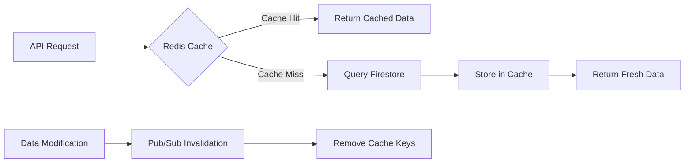

**Cache Strategy by Data Type**:

| Data Type | Cache Key Pattern | TTL | Invalidation Trigger |
|-----------|-------------------|-----|---------------------|
| Business Info | `business:{id}` | 1 hour | Business update |
| Service Catalog | `services:{businessId}` | 2 hours | Service create/update/delete |
| Staff Schedule | `schedule:{staffId}:{date}` | 30 min | Schedule update |
| Availability Slots | `avail:{businessId}:{serviceId}:{date}` | 5 min | Booking create/cancel |
| JWT Public Keys | `jwt:keys` | 24 hours | Manual invalidation only |
| OAuth Tokens | Not cached (security) | - | - |

**Implementation**:

```typescript
class CacheManager {
  private redis: Redis;
  private pubsub: PubSub;
  
  async get<T>(key: string): Promise<T | null> {
    const cached = await this.redis.get(key);
    if (cached) {
      return JSON.parse(cached) as T;
    }
    return null;
  }
  
  async set<T>(key: string, value: T, ttl: number): Promise<void> {
    await this.redis.setex(key, ttl, JSON.stringify(value));
  }
  
  async invalidate(pattern: string): Promise<void> {
    // Publish invalidation message
    await this.pubsub.publish('cache:invalidate', { pattern });
    
    // Local invalidation
    await this.invalidateLocal(pattern);
  }
  
  private async invalidateLocal(pattern: string): Promise<void> {
    const keys = await this.redis.keys(pattern);
    if (keys.length > 0) {
      await this.redis.del(...keys);
    }
  }
  
  // Subscribe to invalidation messages from other instances
  subscribeToInvalidations(): void {
    this.pubsub.subscribe('cache:invalidate', async (message) => {
      await this.invalidateLocal(message.pattern);
    });
  }
}
```

### 2. Database Query Optimization

**Firestore Composite Indexes**:

```javascript
// Required Firestore indexes for optimal query performance
const indexes = [
  {
    collection: 'google_bookings',
    fields: [
      { fieldPath: 'businessId', order: 'ASCENDING' },
      { fieldPath: 'startTime', order: 'ASCENDING' },
      { fieldPath: 'status', order: 'ASCENDING' }
    ]
  },
  {
    collection: 'google_bookings',
    fields: [
      { fieldPath: 'staffId', order: 'ASCENDING' },
      { fieldPath: 'startTime', order: 'ASCENDING' },
      { fieldPath: 'status', order: 'ASCENDING' }
    ]
  },
  {
    collection: 'google_bookings',
    fields: [
      { fieldPath: 'businessId', order: 'ASCENDING' },
      { fieldPath: 'source', order: 'ASCENDING' },
      { fieldPath: 'createdAt', order: 'DESCENDING' }
    ]
  },
  {
    collection: 'google_audit_logs',
    fields: [
      { fieldPath: 'businessId', order: 'ASCENDING' },
      { fieldPath: 'timestamp', order: 'DESCENDING' }
    ]
  },
  {
    collection: 'google_audit_logs',
    fields: [
      { fieldPath: 'eventType', order: 'ASCENDING' },
      { fieldPath: 'status', order: 'ASCENDING' },
      { fieldPath: 'timestamp', order: 'DESCENDING' }
    ]
  }
];
```

**Batch Operations**:

```typescript
// Avoid N+1 query problem
async getBookingsWithDetails(bookingIds: string[]): Promise<BookingWithDetails[]> {
  // BAD: N+1 queries
  // for (const id of bookingIds) {
  //   const booking = await getBooking(id);
  //   const service = await getService(booking.serviceId);
  //   const staff = await getStaff(booking.staffId);
  // }
  
  // GOOD: Batch reads
  const bookings = await firestore
    .collection('google_bookings')
    .where(firestore.FieldPath.documentId(), 'in', bookingIds)
    .get();
  
  const serviceIds = [...new Set(bookings.docs.map(d => d.data().serviceId))];
  const staffIds = [...new Set(bookings.docs.map(d => d.data().staffId))];
  
  const [services, staff] = await Promise.all([
    firestore.collection('services')
      .where(firestore.FieldPath.documentId(), 'in', serviceIds)
      .get(),
    firestore.collection('staff')
      .where(firestore.FieldPath.documentId(), 'in', staffIds)
      .get()
  ]);
  
  // Build maps for O(1) lookup
  const serviceMap = new Map(services.docs.map(d => [d.id, d.data()]));
  const staffMap = new Map(staff.docs.map(d => [d.id, d.data()]));
  
  return bookings.docs.map(doc => ({
    ...doc.data(),
    service: serviceMap.get(doc.data().serviceId),
    staff: staffMap.get(doc.data().staffId)
  }));
}
```

### 3. Asynchronous Processing

**Queue Priority Levels**:

```typescript
enum JobPriority {
  CRITICAL = 1,    // CreateBooking post-processing, webhook
  HIGH = 5,        // Feed generation, GBP updates
  NORMAL = 10,     // Email notifications
  LOW = 15         // Analytics tracking, cleanup jobs
}

// Queue configuration
const queueConfig = {
  'booking-processing': {
    concurrency: 10,
    priority: JobPriority.CRITICAL,
    attempts: 3,
    backoff: {
      type: 'exponential',
      delay: 2000
    }
  },
  'feed-generation': {
    concurrency: 2,
    priority: JobPriority.HIGH,
    attempts: 5,
    backoff: {
      type: 'exponential',
      delay: 60000
    }
  },
  'notifications': {
    concurrency: 20,
    priority: JobPriority.NORMAL,
    attempts: 3,
    backoff: {
      type: 'exponential',
      delay: 5000
    }
  }
};
```

### 4. Connection Pooling

```typescript
// Redis connection pool
const redisPool = new Redis({
  host: process.env.REDIS_HOST,
  port: 6379,
  maxRetriesPerRequest: 3,
  enableReadyCheck: true,
  lazyConnect: false,
  // Connection pool settings
  connectionPool: {
    min: 10,
    max: 50,
    acquireTimeoutMillis: 30000,
    idleTimeoutMillis: 60000
  }
});

// Firestore - uses built-in connection pooling
const firestore = admin.firestore();
firestore.settings({
  ignoreUndefinedProperties: true,
  // Firestore automatically manages connection pooling
});
```

### 5. Response Compression

```typescript
import compression from 'compression';

app.use(compression({
  filter: (req, res) => {
    if (req.headers['x-no-compression']) {
      return false;
    }
    return compression.filter(req, res);
  },
  level: 6, // Compression level (1-9)
  threshold: 1024 // Only compress responses > 1KB
}));
```

### 6. CDN and Static Asset Optimization

```typescript
// Appointment Landing Page optimization
const landingPageConfig = {
  // Vercel Edge Network (CDN)
  headers: {
    'Cache-Control': 'public, s-maxage=3600, stale-while-revalidate=86400',
    'X-Content-Type-Options': 'nosniff',
    'X-Frame-Options': 'SAMEORIGIN',
    'X-XSS-Protection': '1; mode=block'
  },
  
  // Image optimization
  images: {
    domains: ['yourplatform.com', 'storage.googleapis.com'],
    formats: ['image/avif', 'image/webp'],
    minimumCacheTTL: 3600
  },
  
  // Code splitting
  webpack: {
    splitChunks: {
      chunks: 'all',
      cacheGroups: {
        vendor: {
          test: /[\\/]node_modules[\\/]/,
          name: 'vendors',
          priority: 10
        }
      }
    }
  }
};
```

### 7. API Rate Limiting with Redis

```typescript
class RedisRateLimiter {
  async checkLimit(
    key: string, 
    limit: number, 
    window: number
  ): Promise<{ allowed: boolean; remaining: number; resetAt: number }> {
    const now = Date.now();
    const windowKey = `${key}:${Math.floor(now / (window * 1000))}`;
    
    // Use Lua script for atomic increment
    const script = `
      local current = redis.call('incr', KEYS[1])
      if current == 1 then
        redis.call('expire', KEYS[1], ARGV[1])
      end
      return current
    `;
    
    const current = await this.redis.eval(script, 1, windowKey, window);
    const allowed = current <= limit;
    const remaining = Math.max(0, limit - current);
    const resetAt = Math.ceil(now / (window * 1000)) * (window * 1000);
    
    return { allowed, remaining, resetAt };
  }
}

// Usage in middleware
app.use('/v1/google/*', async (req, res, next) => {
  const merchantId = req.body.merchant_id;
  const endpoint = req.path;
  const key = `ratelimit:${endpoint}:${merchantId}`;
  
  const limits = {
    '/checkAvailability': { limit: 10, window: 1 }, // 10/sec
    '/createBooking': { limit: 5, window: 1 }       // 5/sec
  };
  
  const config = limits[endpoint];
  const result = await rateLimiter.checkLimit(key, config.limit, config.window);
  
  res.setHeader('X-RateLimit-Limit', config.limit);
  res.setHeader('X-RateLimit-Remaining', result.remaining);
  res.setHeader('X-RateLimit-Reset', result.resetAt);
  
  if (!result.allowed) {
    return res.status(429).json({
      error: {
        code: 'RATE_LIMIT_EXCEEDED',
        message: 'Too many requests',
        retry_after: Math.ceil((result.resetAt - Date.now()) / 1000)
      }
    });
  }
  
  next();
});
```

### 8. Monitoring and Alerting

**Key Metrics to Track**:

```typescript
interface PerformanceMetrics {
  // API Latency
  checkAvailability_p50: number;
  checkAvailability_p95: number;
  checkAvailability_p99: number;
  createBooking_p50: number;
  createBooking_p95: number;
  createBooking_p99: number;
  
  // Throughput
  requests_per_second: number;
  bookings_per_minute: number;
  
  // Cache Performance
  cache_hit_ratio: number;
  cache_eviction_rate: number;
  
  // Error Rates
  error_rate_4xx: number;
  error_rate_5xx: number;
  timeout_rate: number;
  
  // Resource Utilization
  redis_memory_usage: number;
  firestore_read_ops: number;
  firestore_write_ops: number;
  
  // Business Metrics
  booking_success_rate: number;
  double_booking_incidents: number;
}

// Alert thresholds
const alerts = {
  criticalLatency: {
    condition: 'p95 > 1500ms for checkAvailability OR p95 > 2500ms for createBooking',
    action: 'page-oncall',
    severity: 'critical'
  },
  highErrorRate: {
    condition: 'error_rate_5xx > 5% for 5 minutes',
    action: 'page-oncall',
    severity: 'critical'
  },
  lowCacheHitRatio: {
    condition: 'cache_hit_ratio < 70% for 15 minutes',
    action: 'notify-team',
    severity: 'warning'
  },
  doubleBooking: {
    condition: 'double_booking_incidents > 0',
    action: 'page-oncall',
    severity: 'critical'
  }
};
```

## Deployment Strategy

### Deployment Phases

#### Phase 1: Infrastructure Setup (Week 1-2)

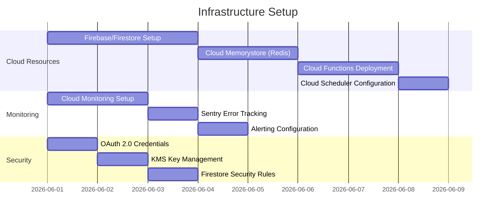

#### Phase 2: Aşama 1 Deployment - Google Görünürlük (Week 3-6)

**Deployment Steps**:

1. **Backend Services**:
   ```bash
   # Deploy OAuth service
   gcloud functions deploy oauth-service \
     --runtime nodejs18 \
     --trigger-http \
     --allow-unauthenticated=false \
     --set-env-vars GOOGLE_CLIENT_ID=xxx,GOOGLE_CLIENT_SECRET=xxx
   
   # Deploy GBP integration service
   gcloud functions deploy gbp-integration \
     --runtime nodejs18 \
     --trigger-http \
     --timeout 540s \
     --memory 512MB
   ```

2. **Frontend Deployment** (Vercel):
   ```bash
   vercel --prod
   ```

3. **Database Migrations**:
   ```bash
   npm run firestore:deploy-indexes
   npm run firestore:deploy-rules
   ```

4. **Smoke Tests**:
   ```bash
   npm run test:e2e:smoke
   ```

#### Phase 3: Aşama 2 Deployment - Google Rezervasyon (Week 7-14)

**Google Actions Center Onboarding**:

1. Submit partner application to Google
2. Provide technical documentation
3. Complete integration testing with Google's test environment
4. Pass Google's End-to-End Testing Tool validation
5. Production approval from Google

**Deployment Steps**:

1. **RWG API Deployment**:
   ```bash
   # Deploy CheckAvailability endpoint
   gcloud functions deploy rwg-check-availability \
     --runtime nodejs18 \
     --trigger-http \
     --timeout 10s \
     --memory 512MB \
     --max-instances 100
   
   # Deploy CreateBooking endpoint
   gcloud functions deploy rwg-create-booking \
     --runtime nodejs18 \
     --trigger-http \
     --timeout 20s \
     --memory 512MB \
     --max-instances 100
   ```

2. **Feed Generator Deployment**:
   ```bash
   gcloud functions deploy feed-generator \
     --runtime nodejs18 \
     --trigger-topic feed-generation-trigger \
     --timeout 540s \
     --memory 1GB
   
   # Create Cloud Scheduler jobs
   gcloud scheduler jobs create pubsub merchant-feed-job \
     --schedule="0 3 * * *" \
     --topic=feed-generation-trigger \
     --message-body='{"feedType":"merchant"}'
   ```

3. **Load Testing**:
   ```bash
   artillery run --config artillery-config.yml
   ```

### Blue-Green Deployment Strategy

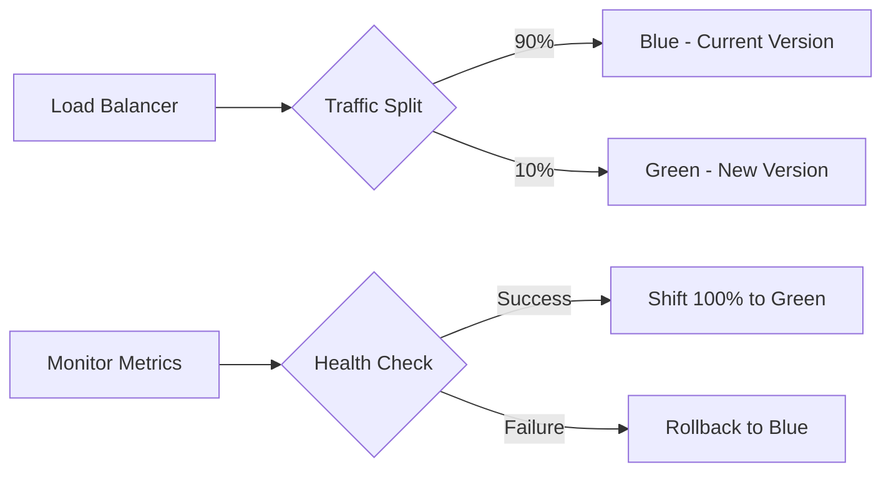

**Implementation**:

```typescript
// Cloud Functions traffic splitting
const deploymentConfig = {
  blue: {
    version: 'v1.2.0',
    traffic: 90,
    instances: 50
  },
  green: {
    version: 'v1.3.0',
    traffic: 10,
    instances: 10
  },
  canaryDuration: '30m',
  successCriteria: {
    errorRate: '<1%',
    p95Latency: '<1500ms',
    successRate: '>99%'
  }
};
```

### Rollback Plan

```typescript
interface RollbackProcedure {
  triggers: [
    'error_rate > 5%',
    'p95_latency > 2x baseline',
    'critical_bug_detected',
    'data_corruption_detected'
  ];
  
  steps: [
    '1. Stop new deployments',
    '2. Shift 100% traffic to previous version',
    '3. Rollback database migrations (if any)',
    '4. Clear caches',
    '5. Notify stakeholders',
    '6. Post-mortem analysis'
  ];
  
  estimatedDuration: '15 minutes';
}
```

### Health Checks

```typescript
// GET /health endpoint
app.get('/health', async (req, res) => {
  const checks = await Promise.allSettled([
    checkFirestore(),
    checkRedis(),
    checkGoogleAPI(),
    checkQueueSystem()
  ]);
  
  const results = {
    status: 'healthy',
    timestamp: new Date().toISOString(),
    services: {
      firestore: checks[0].status === 'fulfilled' ? 'healthy' : 'unhealthy',
      redis: checks[1].status === 'fulfilled' ? 'healthy' : 'unhealthy',
      google_api: checks[2].status === 'fulfilled' ? 'healthy' : 'unhealthy',
      queue: checks[3].status === 'fulfilled' ? 'healthy' : 'unhealthy'
    },
    version: process.env.VERSION
  };
  
  const allHealthy = Object.values(results.services).every(s => s === 'healthy');
  results.status = allHealthy ? 'healthy' : 'degraded';
  
  const statusCode = allHealthy ? 200 : 503;
  res.status(statusCode).json(results);
});
```

## Security Considerations

### 1. OAuth Token Security

- **Encryption**: AES-256-GCM with Cloud KMS managed keys
- **Storage**: Encrypted tokens in Firestore with field-level encryption
- **Transmission**: Always use HTTPS for token exchange
- **Rotation**: Automatic access token refresh, manual refresh token rotation every 90 days
- **Revocation**: Immediate token deletion on user disconnect

### 2. JWT Validation Security

- **Algorithm**: RS256 (RSA signature with SHA-256)
- **Key Rotation**: Fetch Google's public keys daily
- **Replay Protection**: Track used JTI (JWT ID) in Redis for 1 hour
- **Expiration**: Strict expiration checking, no grace period
- **Issuer Validation**: Only accept tokens from `https://accounts.google.com`

### 3. API Security Headers

```typescript
app.use((req, res, next) => {
  res.setHeader('Strict-Transport-Security', 'max-age=31536000; includeSubDomains');
  res.setHeader('X-Content-Type-Options', 'nosniff');
  res.setHeader('X-Frame-Options', 'DENY');
  res.setHeader('X-XSS-Protection', '1; mode=block');
  res.setHeader('Content-Security-Policy', 
    "default-src 'self'; script-src 'self' 'unsafe-inline' https://www.googletagmanager.com");
  res.setHeader('Referrer-Policy', 'strict-origin-when-cross-origin');
  next();
});
```

### 4. Input Sanitization

```typescript
import { sanitize } from 'isomorphic-dompurify';
import validator from 'validator';

function sanitizeInput(input: any): any {
  if (typeof input === 'string') {
    return sanitize(validator.trim(input));
  }
  if (Array.isArray(input)) {
    return input.map(sanitizeInput);
  }
  if (typeof input === 'object' && input !== null) {
    return Object.fromEntries(
      Object.entries(input).map(([key, value]) => [key, sanitizeInput(value)])
    );
  }
  return input;
}
```

### 5. Secrets Management

```bash
# Store secrets in Cloud Secret Manager
gcloud secrets create google-client-secret \
  --data-file=./client-secret.json \
  --replication-policy=automatic

# Grant Cloud Functions access to secrets
gcloud secrets add-iam-policy-binding google-client-secret \
  --member=serviceAccount:functions@project.iam.gserviceaccount.com \
  --role=roles/secretmanager.secretAccessor
```

### 6. Firestore Security Rules

```javascript
rules_version = '2';
service cloud.firestore {
  match /databases/{database}/documents {
    // Google integrations - business owner only
    match /google_integrations/{businessId} {
      allow read: if request.auth != null 
                  && request.auth.token.businessId == businessId;
      allow write: if request.auth != null 
                   && request.auth.token.businessId == businessId
                   && request.auth.token.role == 'owner';
    }
    
    // Google bookings - read by business or customer
    match /google_bookings/{bookingId} {
      allow read: if request.auth != null 
                  && (resource.data.businessId == request.auth.token.businessId
                      || resource.data.customer.id == request.auth.uid);
      allow create: if request.auth != null;
      allow update: if request.auth != null 
                    && resource.data.businessId == request.auth.token.businessId;
    }
    
    // Audit logs - admin only
    match /google_audit_logs/{logId} {
      allow read: if request.auth != null 
                  && request.auth.token.role == 'admin';
      allow write: if false; // Only server-side writes
    }
  }
}
```

## Conclusion

This design document provides a comprehensive technical architecture for integrating Google Maps and Google Business Profile with the booking platform. The two-phase approach ensures rapid value delivery (Phase 1) while building towards a complete Reserve with Google integration (Phase 2).

### Key Architectural Decisions

1. **Serverless Architecture**: Cloud Functions for auto-scaling and cost optimization
2. **Redis Caching**: Low-latency caching with 5-minute TTL for availability data
3. **Distributed Locking**: Race condition prevention using Redis SETNX
4. **Asynchronous Processing**: Bull queues for non-critical operations
5. **Circuit Breakers**: Graceful degradation when external services fail
6. **Property-Based Testing**: Comprehensive correctness validation

### Success Metrics

- **Performance**: p95 latency < 1000ms (CheckAvailability), < 2000ms (CreateBooking)
- **Reliability**: 99.9% uptime, zero double-booking incidents
- **Security**: Zero token leakage, 100% JWT validation
- **Business**: 30% increase in bookings from Google sources

### Next Steps

1. Review and approval of design document
2. Create implementation tasks from design
3. Set up development environment
4. Begin Phase 1 implementation (OAuth + GBP)
5. Google Actions Center partner application for Phase 2
