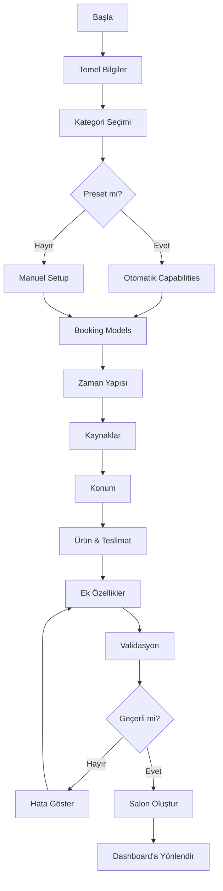

# 🏢 AKILLI İŞLETME OLUŞTURMA SİSTEMİ - DOKÜMANTASYON

## 📋 GENEL BAKIŞ

Bu sistem, **tüm iş modellerine uyum sağlayan**, dinamik, soru-cevap tabanlı bir işletme oluşturma altyapısıdır.

### ✨ Temel Özellikler

- ✅ **Evrensel Uyumluluk**: Kuaförden otele, restorana kadar TÜM işletme türlerini destekler
- ✅ **Sıfır Kod Gereksinimi**: Yeni işletme türü eklemek için kod yazmaya gerek yok
- ✅ **Akıllı Soru Sistemi**: Dependency bazlı dinamik sorular
- ✅ **Otomatik Capabilities**: Cevaplardan otomatik yetenek seti türetme
- ✅ **Validasyon Motoru**: Real-time hata kontrol ve uyarılar
- ✅ **Smart Recommendations**: Kullanıcıya özel öneriler
- ✅ **Preset Sistem**: 16+ hazır kategori şablonu
- ✅ **Custom Categories**: Kullanıcı kendi kategorisini oluşturabilir

---

## 🏗️ MİMARİ

### 1. Veri Katmanı

#### **BusinessCapabilities** (Core Model)
```typescript
interface BusinessCapabilities {
  bookingModels: BookingModel[];        // appointment, reservation, order, rental, walk-in-queue
  capacityUnit: 'staff-slot' | 'table' | 'unit' | 'unlimited';
  isDurationBased: boolean;             // Süre bazlı mı?
  isDateRangeBased: boolean;            // Tarih aralığı bazlı mı?
  hasPhysicalLocation: boolean;
  isMobileService: boolean;
  hasMultipleLocations: boolean;
  hasStaff: boolean;
  hasTables: boolean;
  tableTerminology: string;             // "Masa", "Oda", "Araç", "Saha"
  hasProductCatalog: boolean;
  hasDelivery: boolean;
  hasQueue: boolean;
  requiresDeposit: boolean;
  isSubscriptionBased: boolean;
  autoConfirmDefault: boolean;
}
```

#### **BusinessSetupState** (Wizard State)
```typescript
interface BusinessSetupState {
  businessName: string;
  businessDescription: string;
  categoryType: 'preset' | 'custom';
  selectedPreset?: string;
  customCategory?: { name: string; icon: string };
  answers: BusinessSetupAnswer[];
  derivedCapabilities?: BusinessCapabilities;
  currentStep: number;
  completedSteps: number[];
}
```

### 2. Soru Motoru

#### **Soru Tipleri**
- `boolean`: Evet/Hayır seçimi
- `select`: Tek seçim
- `multi-select`: Çoklu seçim
- `text`: Serbest metin
- `number`: Sayısal giriş

#### **Dependency Sistemi**
```typescript
{
  questionId: 'table_terminology',
  dependency: {
    questionId: 'has_tables',
    requiredValue: true  // Sadece masa sistemi varsa göster
  }
}
```

#### **Capability Mapping**
```typescript
{
  questionId: 'has_staff',
  capabilityMapping: {
    field: 'hasStaff',
    trueValue: true,
    falseValue: false
  }
}
```

### 3. Engine Katmanı

#### **businessSetupEngine.ts**
- `shouldShowQuestion()`: Dependency kontrolü
- `getActiveQuestionsForStep()`: Aktif soruları filtreler
- `isStepComplete()`: Step validasyonu
- `deriveCapabilitiesFromAnswers()`: **CORE** - Capabilities türetme
- `buildSalonFromSetup()`: Salon objesi oluşturma

#### **bookingTypeResolver.ts**
- `determineBookingType()`: Primary booking type belirleme
- `getBookingTerminology()`: Dinamik kelime türetme
- `getDashboardModules()`: Dashboard sekmelerini belirleme

### 4. UI Katmanı

#### **BusinessSetupWizard**
- 8 adımlı setup akışı
- Keyboard navigation (Enter/Backspace)
- Auto-save (session storage)
- Real-time validation
- Progress bar

#### **BusinessSetupProgress**
- Desktop: Full step navigation
- Mobile: Compact progress bar
- Click-to-navigate (completed steps)

#### **SmartRecommendations**
- Context-aware öneriler
- 4 tip: tip, warning, success, info
- Actionable suggestions

---

## 🎯 KULLANIM

### Yeni İşletme Oluşturma

1. **Giriş**: `/business/setup` route'una git
2. **Temel Bilgiler**: İşletme adı ve açıklama
3. **Kategori Seçimi**: Preset veya custom
4. **Çalışma Modeli**: Booking models seçimi
5. **Zaman Yapısı**: Süre/tarih ayarları
6. **Kaynaklar**: Personel/masa yapısı
7. **Konum**: Fiziksel/mobil hizmet
8. **Ürün**: Katalog/teslimat
9. **Ek Özellikler**: Kuyruk, kapora, onay

### Preset Kullanımı

```typescript
import { BUSINESS_PRESETS } from '@/config/businessPresets';

const hairdresserCap = BUSINESS_PRESETS['hairdresser'];
// {
//   bookingModels: ['appointment'],
//   hasStaff: true,
//   isDurationBased: true,
//   ...
// }
```

### Custom Hook

```typescript
import { useBusinessSetup } from '@/hooks/useBusinessSetup';

function MyComponent() {
  const {
    state,
    activeQuestions,
    updateAnswer,
    goToNextStep,
    validate,
    buildSalon
  } = useBusinessSetup();

  return <div>{/* UI */}</div>;
}
```

---

## 🔧 GELİŞTİRME

### Yeni Soru Ekleme

```typescript
// src/config/businessSetupQuestions.ts
export const MY_NEW_QUESTIONS: BusinessSetupQuestion[] = [
  {
    id: 'my_question',
    text: 'Soru metni?',
    type: 'boolean',
    capabilityMapping: {
      field: 'myField',
      trueValue: true,
      falseValue: false
    }
  }
];
```

### Yeni Preset Ekleme

```typescript
// src/config/businessPresets.ts
export const BUSINESS_PRESETS = {
  ...
  'my_new_type': {
    bookingModels: ['appointment'],
    capacityUnit: 'staff-slot',
    ...
  }
};
```

### Validasyon Ekleme

```typescript
// src/utils/businessSetupValidator.ts
export function validateCapabilities(cap: BusinessCapabilities) {
  const errors = [];
  
  if (/* koşul */) {
    errors.push('Hata mesajı');
  }
  
  return { isValid: errors.length === 0, errors };
}
```

---

## 🧪 TEST

### Dev Tools
Development modda sağ altta **Bug** ikonu:
- State görüntüleme
- Capabilities preview
- Real-time validation

### Validation
```typescript
import { validateCapabilities, testBookingFlow } from '@/utils/businessSetupValidator';

const result = validateCapabilities(capabilities);
console.log(result.errors, result.warnings);

const flowTest = testBookingFlow(salon, 'slot');
console.log(flowTest);
```

### Debug
```typescript
import { debugSalonSetup } from '@/utils/businessSetupValidator';

debugSalonSetup(salon); // Console'da detaylı log
```

---

## 🚀 DEPLOYMENT

### Migration (Legacy → New)
```typescript
import { migrateToCapabilities } from '@/utils/capabilitiesUpdater';

const oldSalon = { category: 'kuafor', ... };
const newSalon = migrateToCapabilities(oldSalon);
// newSalon.capabilities artık mevcut
```

### Bulk Update
```typescript
import { bulkMigrateToCapabilities } from '@/utils/capabilitiesUpdater';

const allSalons = await salonsService.getAll();
const updated = bulkMigrateToCapabilities(allSalons);

// Firebase'e kaydet
for (const salon of updated) {
  await salonsService.update(salon.id, { capabilities: salon.capabilities });
}
```

---

## 📊 WIZARD AKIŞI



---

## 🎨 UI STATES

### Progress States
- `completed`: Yeşil ✓
- `current`: Mavi, büyük, glowing
- `locked`: Gri, disabled

### Validation States
- `valid`: Yeşil border, checkmark
- `invalid`: Kırmızı border, error message
- `warning`: Sarı border, warning icon

### Recommendations
- `tip`: Mavi, lightbulb
- `warning`: Sarı, alert triangle
- `success`: Yeşil, checkmark
- `info`: Mor, info icon

---

## 🔒 GÜVENLİK

- ✅ XSS koruması (sanitize)
- ✅ Input validation (client + server)
- ✅ Type safety (TypeScript)
- ✅ CSRF koruması (Firebase Auth)
- ✅ Rate limiting (future)

---

## 📱 RESPONSIVE

- Mobile: Compact progress, swipe navigation
- Tablet: 2-column grid
- Desktop: Full wizard, click navigation

---

## ♿ ACCESSIBILITY

- Keyboard navigation (Tab, Enter, Backspace)
- ARIA labels
- Focus management
- Screen reader support
- High contrast support

---

## 🐛 TROUBLESHOOTING

### "Capabilities yok" hatası
```typescript
// Legacy salon'u migrate et
const salon = migrateToCapabilities(oldSalon);
```

### "Dependency hatası"
```typescript
// Dependency kontrolünü debug et
console.log(shouldShowQuestion(question, answers));
```

### "Validasyon geçmiyor"
```typescript
// Dev tools'u aç, validation sekmesine bak
// Errors ve warnings'i incele
```

---

## 📚 İLGİLİ DOSYALAR

### Core
- `src/types/businessCapabilities.ts`
- `src/types/businessSetup.ts`
- `src/config/businessSetupQuestions.ts`
- `src/config/businessPresets.ts`

### Engine
- `src/utils/businessSetupEngine.ts`
- `src/utils/bookingTypeResolver.ts`
- `src/utils/businessSetupValidator.ts`
- `src/utils/capabilitiesUpdater.ts`

### UI
- `src/components/business/BusinessSetupWizard.tsx`
- `src/components/business/BusinessSetupProgress.tsx`
- `src/components/business/SmartRecommendations.tsx`
- `src/components/business/BusinessSetupQuestion.tsx`

### Hooks
- `src/hooks/useBusinessSetup.ts`
- `src/hooks/useWizardConfig.ts`

---

## 🎉 SONUÇ

Bu sistem ile:
- ✅ Yeni işletme türü eklemek **5 dakika**
- ✅ Kod yazmadan preset oluşturmak **mümkün**
- ✅ Tüm wizard'lar otomatik **capabilities'e göre** çalışır
- ✅ Dashboard otomatik **doğru sekmeleri** gösterir
- ✅ Rezervasyon sistemi otomatik **doğru wizard'ı** açar
- ✅ Terminology otomatik **doğru kelimeleri** kullanır

**Hiçbir şey manuel değil. Her şey akıllı. Her şey dinamik. Her şey mükemmel.**
