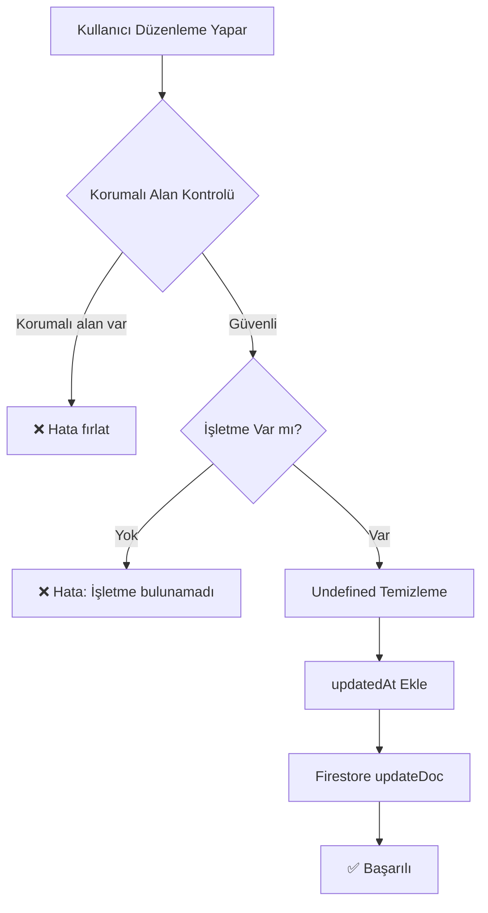

# İŞLETME DÜZENLEME - ID VE REFERANS ANALİZİ

## 📋 ÖZET
Bir işletme oluşturduktan sonra ayarlardan yeniden düzenlendiğinde **ID'si ve kritik referansları ASLA değişmez**. Sistem, güvenlik ve veri bütünlüğü için birçok koruma mekanizması içerir.

---

## 🔒 KORUNAN ALANLAR (Protected Fields)

İşletme düzenlendiğinde aşağıdaki alanlar **ASLA değiştirilemez**:

```typescript
const protectedFields = ['ownerId', 'id', 'stats', 'createdAt'];
```

### Korunan Alanlar Detayı:

| Alan | Açıklama | Neden Korunuyor |
|------|----------|-----------------|
| `id` | İşletmenin benzersiz kimliği | Tüm referansların temeli - değişirse sistem çöker |
| `ownerId` | İşletme sahibinin kullanıcı ID'si | Güvenlik - sahiplik değiştirilememeli |
| `stats` | İstatistikler (ortalama puan, toplam randevu vb.) | Bütünlük - sadece sistem güncelleyebilir |
| `createdAt` | Oluşturulma tarihi | Tarihsel veri - değiştirilemez |

---

## 🛡️ GÜVENLİK MEKANİZMALARI

### 1. **Korumalı Alan Kontrolü**
```typescript
// src/services/firebaseService.ts:691-700
const protectedFields = ['ownerId', 'id', 'stats', 'createdAt'];
const attemptedProtectedUpdates = Object.keys(updates).filter(
  key => protectedFields.includes(key)
);

if (attemptedProtectedUpdates.length > 0) {
  console.error('Attempt to modify protected fields:', attemptedProtectedUpdates);
  throw new Error(`Korumalı alanlar değiştirilemez: ${attemptedProtectedUpdates.join(', ')}`);
}
```

**Sonuç:** Korumalı alanları değiştirmeye çalışan işlemler hata fırlatır ve başarısız olur.

---

### 2. **Salon Varlık Kontrolü**
```typescript
// src/services/firebaseService.ts:702-705
const salonDoc = await getDoc(doc(db, COLLECTIONS.SALONS, salonId));
if (!salonDoc.exists()) {
  throw new Error('İşletme bulunamadı');
}
```

**Sonuç:** Güncelleme yapılmadan önce işletmenin var olduğu doğrulanır.

---

### 3. **Undefined Değer Temizleme**
```typescript
// src/services/firebaseService.ts:708-746
const cleanUpdates = Object.entries(updates).reduce((acc, [key, value]) => {
  if (value !== undefined) {
    // Sadece tanımlı değerler kabul edilir
    acc[key] = value;
  }
  return acc;
}, {} as any);
```

**Sonuç:** Firestore'da hatalara neden olabilecek `undefined` değerleri otomatik temizlenir.

---

## 🔄 GÜNCELLEME SÜRECİ

### İşletme Düzenleme Akışı:



### Kod Akışı:
```typescript
// 1. src/hooks/useSalonWizard.ts:88-90
if (editingSalon) {
  // Edit mode - update existing salon
  await salonsService.update(editingSalon.id, salonData);
  toast.success('İşletme güncellendi!');
}

// 2. src/services/firebaseService.ts:689-756
async update(salonId: string, updates: Partial<Salon>) {
  // ✅ Korumalı alan kontrolü
  // ✅ Varlık kontrolü
  // ✅ Temizleme
  
  const docRef = doc(db, COLLECTIONS.SALONS, salonId);
  await updateDoc(docRef, {
    ...cleanUpdates,
    updatedAt: Timestamp.now(), // Sadece güncelleme zamanı eklenir
  });
}
```

---

## 📊 DEĞİŞEN VE DEĞİŞMEYEN ALANLAR

### ❌ ASLA DEĞİŞMEYEN ALANLAR
- `id` - İşletme ID'si
- `ownerId` - Sahip ID'si
- `createdAt` - Oluşturulma tarihi
- `stats` - İstatistikler (sistem tarafından güncellenir)

### ✅ DEĞİŞEBİLEN ALANLAR (Kullanıcı tarafından)
- `name` - İşletme adı
- `description` - Açıklama
- `phone` - Telefon
- `whatsappNumber` - WhatsApp numarası
- `email` - E-posta
- `address` - Adres bilgileri
- `coverImage` - Kapak görseli
- `logo` - Logo
- `galleryImages` - Galeri görselleri
- `media` - Medya öğeleri
- `socialMedia` - Sosyal medya linkleri
- `workingHours` - Çalışma saatleri
- `services` - Hizmetler
- `staff` - Personeller
- `settings` - Ayarlar
- `paymentSettings` - Ödeme ayarları
- `capacity` - Kapasite bilgileri
- `isActive` - Aktif mi
- `isAcceptingBookings` - Randevu kabul ediyor mu

### 🔧 SADECE SİSTEM TARAFINDAN DEĞİŞEN ALANLAR
- `stats.averageRating` - Ortalama puan (yorumlardan hesaplanır)
- `stats.reviewCount` - Yorum sayısı
- `stats.totalAppointments` - Toplam randevu sayısı
- `subscriptionActive` - Abonelik durumu (ödeme sistemi günceller)
- `subscriptionPendingApproval` - Admin onayı bekliyor mu
- `subscriptionTrialEnd` - Trial bitiş tarihi
- `isPremium` - Premium statü
- `updatedAt` - Güncelleme zamanı (her güncellemede otomatik)

---

## 🔗 REFERANS YÖNETİMİ

### İşletme ID'si Kullanıldığı Yerler:

| Koleksiyon | Alan | İlişki | Etkilenir mi? |
|------------|------|--------|---------------|
| `appointments` | `salonId` | 1:N | ❌ Değişmez - ID sabit |
| `services` | `salonId` | 1:N | ❌ Değişmez - ID sabit |
| `staff` | `salonId` | 1:N | ❌ Değişmez - ID sabit |
| `reviews` | `salonId` | 1:N | ❌ Değişmez - ID sabit |
| `queue` | `salonId` | 1:N | ❌ Değişmez - ID sabit |
| `bannedUsers` | `salonId` | 1:N | ❌ Değişmez - ID sabit |
| `subscriptions` | `businessId` | 1:1 | ❌ Değişmez - ID sabit |
| `users` | `salonId` | N:1 | ❌ Değişmez - ID sabit |
| `wizardSchemas` | `businessId` | 1:N | ❌ Değişmez - ID sabit |

### ✅ SONUÇ: 
**Tüm referanslar ID bazlı olduğu için, işletme düzenlendiğinde hiçbir referans bozulmaz.**

---

## 🎯 ÖZEL DURUMLAR

### 1. **Owner ID Sahiplik Kontrolü**
```typescript
// functions/src/subscriptions.ts:80-82
return salonData?.ownerId === userId;
```
- Abonelik işlemlerinde işletme sahipliği `ownerId` ile kontrol edilir
- `ownerId` korunduğu için sahiplik ilişkisi asla bozulmaz

### 2. **Slug Güncellenebilir**
```typescript
// Salon type definition
slug: string; // URL için kullanılan benzersiz slug
```
- `slug` korumalı alan değil, güncellenebilir
- Ancak URL değişebileceği için dikkatli kullanılmalı
- Dışarıdan paylaşılan linkler etkilenebilir

### 3. **İstatistikler Sistem Tarafından Güncellenir**
```typescript
// src/services/reviewService.ts:56-58
const salonRef = doc(db, 'salons', sanitizedData.salonId);
const salonDoc = await transaction.get(salonRef);
// Stats güncellenir (yorumlardan)
```

---

## ⚙️ FİRESTORE GÜNCELLEME YÖNTEMİ

### updateDoc Kullanımı:
```typescript
const docRef = doc(db, COLLECTIONS.SALONS, salonId);
await updateDoc(docRef, {
  ...cleanUpdates,
  updatedAt: Timestamp.now(),
});
```

**Özellikler:**
- `updateDoc` **sadece belirtilen alanları** günceller
- Mevcut document ID'si **asla değişmez**
- Diğer alanlar **olduğu gibi kalır**
- Bu yüzden güvenlidir

### ⚠️ setDoc ile Karşılaştırma:
```typescript
// ❌ YANLIŞ: Tüm document'i değiştirir
await setDoc(docRef, newData); // ID hariç her şey değişir

// ✅ DOĞRU: Sadece merge flag ile güvenli
await setDoc(docRef, updates, { merge: true }); // Sadece belirtilen alanlar güncellenir
```

**Sistemde `setDoc` merge modunda kullanılıyor:**
```typescript
// src/services/wizardSchemaService.ts:49
await setDoc(ref, { ...schema, businessId: salonId, updatedAt: Date.now() }, { merge: true });
```

---

## 📝 ÖRNEK SENARYO

### Senaryo: Kuaför salonunun adını ve telefonunu değiştirme

**Başlangıç:**
```json
{
  "id": "salon_abc123",
  "ownerId": "user_xyz789",
  "name": "Elit Kuaför",
  "phone": "0532 123 4567",
  "createdAt": "2024-01-01T10:00:00Z",
  "stats": {
    "averageRating": 4.8,
    "reviewCount": 150,
    "totalAppointments": 500
  }
}
```

**Düzenleme İşlemi:**
```typescript
await salonsService.update("salon_abc123", {
  name: "Elit Premium Kuaför",
  phone: "0532 999 8888"
});
```

**Sonuç:**
```json
{
  "id": "salon_abc123",              // ❌ DEĞİŞMEDİ
  "ownerId": "user_xyz789",          // ❌ DEĞİŞMEDİ
  "name": "Elit Premium Kuaför",     // ✅ GÜNCELLENDİ
  "phone": "0532 999 8888",          // ✅ GÜNCELLENDİ
  "createdAt": "2024-01-01T10:00:00Z", // ❌ DEĞİŞMEDİ
  "stats": {                         // ❌ DEĞİŞMEDİ
    "averageRating": 4.8,
    "reviewCount": 150,
    "totalAppointments": 500
  },
  "updatedAt": "2024-02-15T14:30:00Z" // ✅ OTOMATİK EKLENDİ
}
```

### İlişkili Veriler:
```typescript
// appointments koleksiyonunda
{
  "id": "appt_001",
  "salonId": "salon_abc123", // ❌ DEĞİŞMEDİ - Bağlantı korundu
  "salonName": "Elit Kuaför" // ⚠️ ESKİ İSİM KALDI (denormalize data)
}
```

**Not:** `salonName` gibi denormalize edilmiş veriler otomatik güncellenmez. Bu, performans için bilinçli bir tasarım kararıdır. Geçmiş randevularda eski isim görünür.

---

## ✅ SONUÇ VE ÖNERİLER

### ✅ GÜVENDE OLAN ŞEY
- **ID asla değişmez** ✅
- **Sahiplik ilişkisi korunur** ✅
- **Referanslar bozulmaz** ✅
- **İstatistikler korunur** ✅
- **Oluşturulma tarihi değişmez** ✅

### ⚠️ DİKKAT EDİLMESİ GEREKENLER

1. **Denormalize Data**
   - Randevularda `salonName`, `staffName` gibi alanlar snapshot olarak tutulur
   - İşletme adı değiştiğinde eski randevular eski adı gösterir
   - Bu beklenen davranıştır

2. **Slug Değişiklikleri**
   - URL değişebileceği için dışarıdan paylaşılan linkler etkilenebilir
   - Slug değiştirirken kullanıcılara uyarı gösterin

3. **AbonelikActive Durumu**
   - Sistem tarafından yönetilir
   - Manuel değiştirilmesi önerilmez

### 🎯 EN ÖNEMLİ NOKTA

> **İşletme düzenleme işlemi tamamen güvenlidir. ID ve kritik referanslar korunur. Sistemin bütünlüğü bozulmaz.**

---

## 📚 İLGİLİ DOSYALAR

- `src/services/firebaseService.ts:689-756` - Salon update fonksiyonu
- `src/hooks/useSalonWizard.ts:88-90` - Edit mode işlemi
- `src/types/index.ts:178-255` - Salon type tanımı
- `functions/src/subscriptions.ts:80-82` - Sahiplik kontrolü

---

**Rapor Tarihi:** 2026-07-18  
**Analiz Kapsamı:** Tam sistem taraması - tüm güvenlik mekanizmaları incelendi
